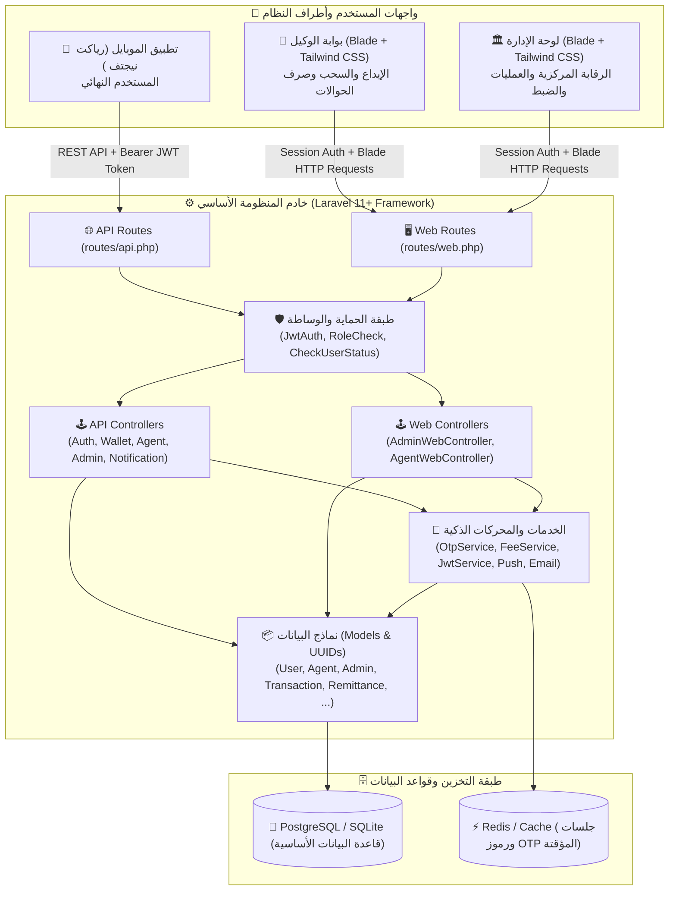
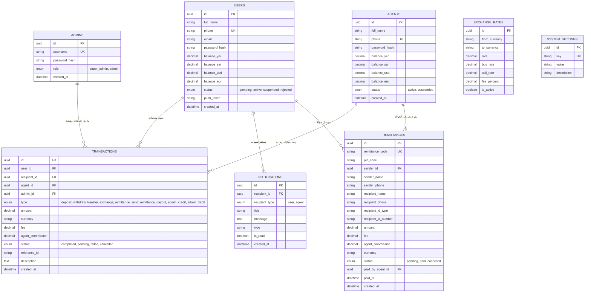
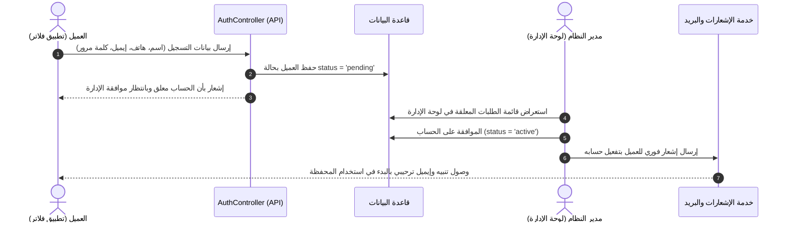
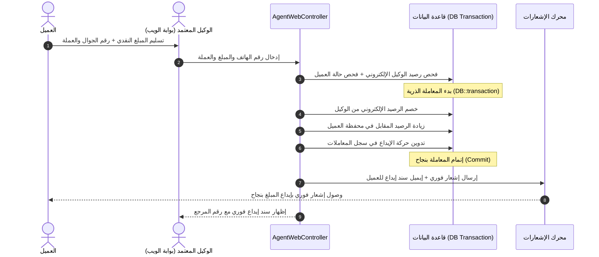
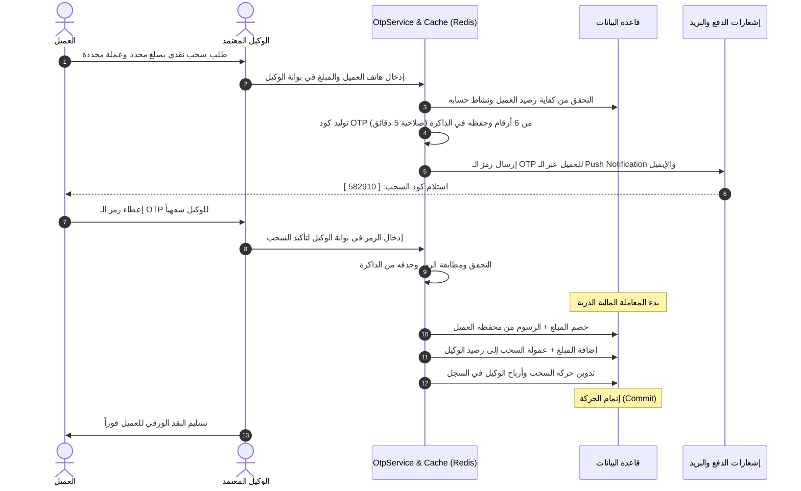

# 🏛️ الدليل الشامل والتحليلي لمنظومة المحفظة الإلكترونية (E-Wallet Core Platform)

---

> 📑 فهرس المحتويات الشامل

1. [نظرة عامة على المشروع وأهدافه (Executive Summary)](#1-نظرة-عامة-على-المشروع-وأهدافه-executive-summary)
2. [المعمارية التقنية وحزمة البرمجيات (Tech Stack &amp; Architecture)](#2-المعمارية-التقنية-وحزمة-البرمجيات-tech-stack--architecture)
3. [الشجرة الكاملة لملفات ومجلدات المشروع (Complete Project Tree)](#3-الشجرة-الكاملة-لملفات-ومجلدات-المشروع-complete-project-tree)
4. [شرح وتفصيل كل مجلد وكل ملف في المنظومة (Detailed Files &amp; Folders Breakdown)](#4-شرح-وتفصيل-كل-مجلد-وكل-ملف-في-المنظومة-detailed-files--folders-breakdown)
   - [4.1 مجلد النماذج وقواعد البيانات (Models &amp; Database)](#41-مجلد-النماذج-appmodels)
   - [4.2 مجلد الخدمات والمحركات الذكية (Services)](#42-مجلد-الخدمات-appservices)
   - [4.3 مجلد وحدات التحكم للواجهات البرمجية (API Controllers)](#43-مجلد-وحدات-التحكم-للـ-api-apphttpcontrollersapi)
   - [4.4 مجلد وحدات التحكم لبوابات الويب (Web Controllers)](#44-مجلد-وحدات-التحكم-لبوابات-الويب-apphttpcontrollersweb)
   - [4.5 طبقة الأمان والوسطاء (Middlewares)](#45-طبقة-الأمان-والوسطاء-apphttpmiddleware)
   - [4.6 مسارات النظام والتوجيه (Routes)](#46-مسارات-النظام-والتوجيه-routes)
   - [4.7 الهجرات وقاعدة البيانات والبيانات الأولية (Database Migrations &amp; Seeders)](#47-الهجرات-وقاعدة-البيانات-والبيانات-الأولية-database)
   - [4.8 واجهات وقوالب العرض (Blade Views &amp; Layouts)](#48-واجهات-وقوالب-العرض-resourcesviews)
   - [4.9 ملفات الإعدادات والتهيئة وتجهيز السيرفرات (Config &amp; Deployment)](#49-ملفات-الإعدادات-والتهيئة-وتجهيز-السيرفرات)
5. [مخطط الكيانات والعلاقات (Database Schema &amp; Entity Relationships)](#5-مخطط-الكيانات-والعلاقات-database-schema--entity-relationships)
6. [دورة حياة وسيناريوهات العمليات المالية (Financial Workflows)](#6-دورة-حياة-وسيناريوهات-العمليات-المالية-financial-workflows)
   - [أ. تسجيل العميل ودورة الموافقة الإدارية (Pending Approval Lifecycle)](#أ-تسجيل-العميل-ودورة-الموافقة-الإدارية)
   - [ب. دورة الإيداع النقدي المباشر عبر الوكيل (Cash-In Flow)](#ب-دورة-الإيداع-النقدي-المباشر-عبر-الوكيل-cash-in)
   - [ج. دورة السحب النقدي الآمن برمز OTP عبر الوكيل (Cash-Out 2-Step Flow)](#ج-دورة-السحب-النقدي-الآمن-برمز-otp-عبر-الوكيل-cash-out)
   - [د. دورة الحوالات النقدية لغير المشتركين بالرمز السري و PIN (Cash Remittances)](#د-دورة-الحوالات-النقدية-لغير-المشتركين-cash-remittances)
   - [هـ. دورة المصارفة اللحظية وتعدد العملات (Multi-Currency Exchange Engine)](#هـ-دورة-المصارفة-اللحظية-وتعدد-العملات)
   - [و. محرك العمولات التلقائية وتقاسم أرباح الوكلاء (Fee &amp; Commission Engine)](#و-محرك-العمولات-التلقائية-وتقاسم-أرباح-الوكلاء)
7. [جدول توثيق واجهات الـ REST API للموبايل (Mobile API Reference)](#7-جدول-توثيق-واجهات-الـ-rest-api-للموبايل)
8. [جدول بوابات الويب للوكيل والإدارة (Web Portals Reference)](#8-جدول-بوابات-الويب-للوكيل-والإدارة)
9. [معايير الأمان و ACID المالي المطبقة (Security &amp; Best Practices)](#9-معايير-الأمان-و-acid-المالي-المطبقة)

---

## 1. نظرة عامة على المشروع وأهدافه (Executive Summary)

منظومة **E-Wallet Core Platform** هي منصة وحل مصرفي مالي متكامل مبني ليعمل كـ Core Banking Platform للمحافظ الإلكترونية وشبكات الوكلاء والصرافة.

### 🌟 أهم مميزات وأهداف المنظومة:

1. **معمارية خادم وعميل متطورة (Client-Server Architecture):** تدعم تطبيقات الموبايل ( +)، بوابات الويب للوكلاء (Agent Portal)، ولوحة الإدارة المركزية (Admin Control Center).
2. **خزائن متعددة العملات (Multi-Currency Vaults):** دعم العملات الرئيسية: الريال اليمني (YER)، الريال السعودي (SAR)، الدولار الأمريكي (USD)، واليورو (EUR).
3. **شبكة الوكلاء المعتمدين (Agents Network):** تمكين الوكلاء من إجراء الإيداعات النقدية، السحب النقدي المؤمّن، وصرف الحوالات النقدية.
4. **الأمان الفائق ورموز OTP المؤقتة:** نظام سحب نقدي معتمد على التحقق بخطوتين عبر رموز OTP سريعة التوليد تنتهي صلاحيتها بعد 5 دقائق.
5. **محرك الحوالات النقدية لغير المشتركين (Cash Remittance):** إرسال أموال لأي شخص غير مسجل في المحفظة عبر كود حوالة ورمز PIN، وصرفها فوراً من أي وكيل.
6. **محرك المصارفة الحية وأسعار الصرف المخصصة:** تحويل سلس بين العملات بأسعار صرف حية وتحديد هوامش بيع وشراء وعمولات خاصة.
7. **نظام الإشعارات متعدد القنوات (Multi-Channel Notifications):** إشعارات لحظية داخل التطبيق (In-App)، إشعارات دفع عبر Firebase/Expo (Push Notifications)، وإشعارات بريد إلكتروني تفاعلية HTML.
8. **الرقابة الإدارية المركزية:** التدقيق والموافقة على الحسابات الجديدة (`Pending`)، تتبع سجل الحركات، ضبط العمولات، وتغذية/تعديل الأرصدة.

---

## 2. المعمارية التقنية وحزمة البرمجيات (Tech Stack & Architecture)



---

## 3. الشجرة الكاملة لملفات ومجلدات المشروع (Complete Project Tree)

```text
d:\WALLET\
│
├── AGENTS.md                          # وثيقة تعريف وهوية المطور الأساسي (م. محمد رشاد الإدريسي)
├── PROJECT_DOCUMENTATION.md           # التوثيق العام ومراجع المنظومة السابقة
├── DETAILED_PROJECT_ANALYSIS.md       # هذا الملف الشامل والتحليلي لكافة تفاصيل المنظومة
├── README.md                          # الدليل التعريفي للمشروع على GitHub
├── RUN_COMMANDS_GUIDE.md              # دليل تشغيل الأوامر والبيئة المحلية والسحابية
├── project_proposal_final(1).md       # وثيقة المقترح النهائي والتحليل الفني للمشروع
├── vercel.json                        # إعدادات النشر على منصة Vercel السحابية
├── dist/                              # مجلد الحزم المبنية والجاهزة للإنتاج
│
└── ewallet-backend/                   # المجلد الرئيسي للمشروع (Laravel Backend)
    ├── .editorconfig                  # إعدادات تنسيق المحرر
    ├── .env                           # ملف متغيرات البيئة الفعلي السري (قواعد البيانات، المفاتيح)
    ├── .env.example                   # نموذج ملف البيئة للمطورين الآخرين
    ├── .gitattributes                 # إعدادات Git للسطور والترميز
    ├── .gitignore                     # الملفات المستثناة من التتبع البرمجي
    ├── .npmrc                         # إعدادات حزم Node.js
    ├── API_DOCUMENTATION.md           # مسودة سريعة لتوثيق الـ APIs
    ├── Dockerfile                     # ملف بناء حاوية Docker للمشروع
    ├── Procfile                       # ملف تشغيل العمليات لمنصات Heroku/Render
    ├── README.md                      # توثيق الباك إند الخاص بلارافيل
    ├── artisan                        # أداة سطر الأوامر الخاصة بلارافيل
    ├── composer.json                  # ملف تعريف حزم ومكتبات PHP والاعتماديات
    ├── composer.lock                  # سجل تثبيت إصدارات حزم PHP الدقيقة
    ├── nixpacks.toml                  # إعدادات بناء بيئة Nixpacks (Render/Railway)
    ├── package.json                   # ملف تعريف حزم JavaScript و Tailwind و Vite
    ├── phpunit.xml                    # إعدادات الاختبارات الآلية (Unit & Feature Tests)
    ├── render.yaml                    # ملف نشر البنية التحتية على سحابة Render
    ├── vercel.json                    # إعدادات تشغيل Laravel كـ Serverless Functions على Vercel
    ├── vite.config.js                 # ملف إعداد مجمّع الأصول Vite
    │
    ├── api/                           # نقطة دخول Vercel Serverless Function
    │   └── index.php                  # معالج تحويل طلبات Vercel إلى Laravel Public
    │
    ├── app/                           # الكود المصدري لمنطق التطبيق (Core Logic)
    │   ├── Http/
    │   │   ├── Controllers/
    │   │   │   ├── Controller.php     # المتحكم الأساسي المشترك
    │   │   │   ├── Api/               # وحدات التحكم الخاصة بـ REST APIs للموبايل والأنظمة الخارجية
    │   │   │   │   ├── AuthController.php          # مصادقة المستخدم وتسجيله واستعادة كلمة المرور
    │   │   │   │   ├── WalletController.php        # العمليات المالية، التحويل، المصارفة، الحوالات
    │   │   │   │   ├── AgentApiController.php      # واجهات الوكيل البرمجية (إيداع، سحب، صرف)
    │   │   │   │   ├── AdminApiController.php      # واجهات الإدارة البرمجية وتفعيل المستخدمين
    │   │   │   │   └── NotificationController.php  # إدارة إشعارات المستخدم والتسجيل في الدفع
    │   │   │   └── Web/               # وحدات التحكم الخاصة بصفحات وبوابات الويب (Blade)
    │   │   │       ├── AdminWebController.php      # إدارة لوحة تحكم الأدمن والتقارير والضبط
    │   │   │       └── AgentWebController.php      # إدارة بوابة الوكيل المعتمد والعمليات اليومية
    │   │   └── Middleware/            # طبقات الوساطة والحماية والتحقق
    │   │       ├── JwtAuth.php        # التحقق من صحة وصلاحية توكن الـ JWT
    │   │       ├── RoleCheck.php      # التحقق من صلاحيات الجلسة (admin أو agent)
    │   │       └── CheckUserStatus.php# منع المستخدمين غير النشطين (Pending/Suspended) من العمليات
    │   │
    │   ├── Models/                    # نماذج الكيانات ومطابقة قاعدة البيانات (Eloquent Models)
    │   │   ├── User.php               # نموذج العميل النهائي والأرصدة متعددة العملات
    │   │   ├── Agent.php              # نموذج الوكيل المعتمد وأرصدته وسجل عملياته
    │   │   ├── Admin.php              # نموذج مدير النظام وصلاحياته
    │   │   ├── Transaction.php        # نموذج الحركات المالية (إيداع، سحب، تحويل، مصارفة)
    │   │   ├── Remittance.php         # نموذج الحوالات النقدية لغير المشتركين
    │   │   ├── ExchangeRate.php       # نموذج أزواج العملات وأسعار الصرف وهوامش الربح
    │   │   ├── SystemSetting.php      # نموذج إعدادات النظام ونسب العمولات والحدود
    │   │   └── Notification.php       # نموذج الإشعارات وسجل التنبيهات
    │   │
    │   ├── Providers/                 # مزودو الخدمات
    │   │   └── AppServiceProvider.php # تهيئة الإعدادات العامة وتسجيل الـ Middlewares
    │   │
    │   └── Services/                  # محركات الأعمال الذكية والخدمات المستقلة
    │       ├── OtpService.php                 # توليد والتحقق من رموز OTP في الذاكرة المؤقتة (5 دقائق)
    │       ├── FeeService.php                 # محرك احتساب الرسوم وعمولات الوكلاء تلقائياً
    │       ├── JwtService.php                 # توليد وفك وتشفير الـ JWT Tokens بدون مكتبات خارجية ثقيلة
    │       ├── PushNotificationService.php   # إرسال إشعارات الدفع لأجهزة الموبايل (Expo/FCM)
    │       └── EmailNotificationService.php  # توليد وإرسال إيميلات HTML غنية بالألوان للحركات و OTP
    │
    ├── bootstrap/                     # ملفات إقلاع النظام
    │   ├── app.php                    # تهيئة تطبيق Laravel 11 وضبط التوجيه والوسطاء
    │   └── providers.php              # تسجيل موفري الخدمات
    │
    ├── config/                        # ملفات إعدادات التطبيق
    │   ├── app.php                    # إعدادات اسم التطبيق، التوقيت، واللغات
    │   ├── auth.php                   # إعدادات الحراس (Guards) ومصادر المستخدمين
    │   ├── cache.php                  # إعدادات التخزين المؤقت (Redis, Database, File)
    │   ├── database.php               # إعدادات الاتصال بـ PostgreSQL, SQLite, MySQL
    │   ├── filesystems.php            # إعدادات وسائط التخزين والملفات
    │   ├── logging.php                # إعدادات سجلات الأخطاء والـ Logs
    │   ├── mail.php                   # إعدادات خادم البريد الإلكتروني (SMTP, Mailgun)
    │   ├── queue.php                  # إعدادات طوابير المهام الخلفية
    │   ├── services.php               # إعدادات الخدمات الخارجية (Expo, Firebase, Mail)
    │   └── session.php                # إعدادات جلسات متصفح الويب
    │
    ├── database/                      # قواعد البيانات والهجرات والبيانات التجريبية
    │   ├── migrations/                # ملفات إنشاء وتعديل جداول قاعدة البيانات
    │   │   ├── 0001_01_01_000000_create_users_table.php        # إنشاء جدول المستخدمين users
    │   │   ├── 0001_01_01_000001_create_cache_table.php        # إنشاء جدول التخزين المؤقت cache
    │   │   ├── 0001_01_01_000002_create_jobs_table.php         # إنشاء جدول طوابير المهام jobs
    │   │   ├── 2026_01_01_000001_create_agents_table.php       # إنشاء جدول الوكلاء agents
    │   │   ├── 2026_01_01_000002_create_admins_table.php       # إنشاء جدول المدراء admins
    │   │   ├── 2026_01_01_000003_create_transactions_table.php # إنشاء جدول المعاملات transactions
    │   │   ├── 2026_01_01_000004_create_notifications_table.php# إنشاء جدول الإشعارات notifications
    │   │   ├── 2026_01_01_000005_create_exchange_rates_table.php# إنشاء جدول أسعار الصرف exchange_rates
    │   │   ├── 2026_01_01_000006_create_system_settings_table.php# إنشاء جدول إعدادات النظام settings
    │   │   ├── 2026_01_01_000007_create_remittances_table.php  # إنشاء جدول الحوالات النقدية remittances
    │   │   ├── 2026_01_01_000008_add_push_token_to_users_table.php # إضافة حقل push_token
    │   │   └── 2026_01_01_000009_fix_sessions_table_user_id.php# تصحيح نوع معرف المستخدم في الجلسات لـ UUID
    │   │
    │   └── seeders/                   # البيانات الأولية والتجريبية
    │       └── DatabaseSeeder.php     # بذر حسابات الأدمن والوكيل والمستخدمين وأسعار الصرف والإعدادات
    │
    ├── public/                        # الملفات المتاحة للوصول العام
    │   ├── index.php                  # نقطة الدخول الرئيسية لجميع طلبات HTTP
    │   ├── robots.txt                 # إعدادات محركات البحث
    │   └── .htaccess                  # إعدادات خادم Apache لإعادة توجيه المسارات
    │
    ├── resources/                     # القوالب والواجهات والأصول الأولية
    │   ├── views/                     # قوالب Blade HTML
    │   │   ├── welcome.blade.php      # الصفحة الترحيبية والواجهة التعريفية للمنظومة
    │   │   ├── layouts/               # القوالب الهيكلية المشتركة (Master Layouts)
    │   │   │   ├── admin.blade.php    # الهيكل العام للوحة تحكم الإدارة (Sidebar, Header, Alerts)
    │   │   │   └── agent.blade.php    # الهيكل العام لبوابة الوكيل (Header, Balance, Modals)
    │   │   │
    │   │   ├── admin/                 # صفحات لوحة تحكم الإدارة
    │   │   │   ├── login.blade.php          # شاشة تسجيل دخول مدير النظام
    │   │   │   ├── dashboard.blade.php      # لوحة القيادة، الإحصائيات الحية، والطلبات المعلقة
    │   │   │   ├── users.blade.php          # جدول إدارة المستخدمين والموافقة والتعليق
    │   │   │   ├── user_details.blade.php   # عرض ملف العميل وأرصدته وسجل حركاته
    │   │   │   ├── agents.blade.php         # جدول الوكلاء وإضافة وكيل وتعديل حالته
    │   │   │   ├── agent_details.blade.php  # ملف الوكيل وسجل عملياته وأرصدته
    │   │   │   ├── adjust_balance.blade.php # أداة التغذية والخصم المباشر للأرصدة من قبل الإدارة
    │   │   │   ├── transactions.blade.php   # السجل المالي العام لكافة عمليات المنظومة
    │   │   │   ├── remittances.blade.php    # مراقبة الحوالات النقدية وحالاتها وإلغائها
    │   │   │   ├── notifications.blade.php  # إرسال إشعارات مخصصة للمستخدمين والوكلاء
    │   │   │   └── settings.blade.php       # إدارة أسعار الصرف، الرسوم، وعمولات الوكلاء
    │   │   │
    │   │   └── agent/                 # صفحات بوابة الوكيل المعتمد
    │   │       ├── login.blade.php          # شاشة تسجيل دخول الوكيل
    │   │       ├── dashboard.blade.php      # لوحة عمليات الوكيل ورصيده وإحصائيات اليوم
    │   │       ├── deposit.blade.php        # واجهة الإيداع النقدي المباشر للمستخدمين
    │   │       ├── withdraw.blade.php       # واجهة طلب السحب النقدي وتوليد رمز OTP
    │   │       ├── withdraw_confirm.blade.php# واجهة إدخال رمز OTP وتأكيد خصم السحب
    │   │       ├── remittance_payout.blade.php# واجهة البحث وصرف الحوالات النقدية بالـ PIN
    │   │       ├── transactions.blade.php   # كشف حساب وعمليات الوكيل وعمولاته المحصلة
    │   │       └── notifications.blade.php  # مركز إشعارات الوكيل وتنبيهات العمليات
    │   │
    │   ├── css/                       # ملفات التنسيق المصدري
    │   │   └── app.css                # استيراد خطوط ومكتبة Tailwind CSS
    │   └── js/                        # ملفات الجافاسكريبت المصدري
    │       ├── app.js                 # التهيئة الأساسية
    │       └── bootstrap.js           # تحميل مكتبة Axios
    │
    ├── routes/                        # ملفات التوجيه والمسارات
    │   ├── api.php                    # مسارات واجهات التطبيق البرمجية REST APIs (الموبايل)
    │   ├── web.php                    # مسارات صفحات الويب وبوابات الإدارة والوكيل (Blade)
    │   └── console.php                # أوامر Artisan المخصصة وجدولة المهام
    │
    ├── storage/                       # التخزين الداخلي والملفات المؤقتة والسجلات
    │   ├── app/                       # الملفات المحفوظة من قبل التطبيق
    │   ├── framework/                 # كاش النظام، الجلسات، وعروض Blade المترجمة
    │   └── logs/                      # ملفات تسجيل الأخطاء والعمليات (laravel.log)
    │
    └── tests/                         # الاختبارات الآلية
        ├── TestCase.php               # فئة الاختبار الأساسية
        ├── Feature/                   # اختبارات الميزات وسيناريوهات العمليات المالية
        └── Unit/                      # اختبارات الدوال والوحدات الفردية
```

---

## 4. شرح وتفصيل كل مجلد وكل ملف في المنظومة (Detailed Files & Folders Breakdown)

---

### 4.1 مجلد النماذج (`app/Models`)

النماذج تمثل الكيانات الأساسية (Entities) وتعتمد على `UUIDs` بدلاً من الأرقام التسلسلية لتعزيز الأمان ضد هجمات التخمين.

#### 1. [`User.php`](file:///d:/WALLET/ewallet-backend/app/Models/User.php)

* **الوظيفة:** يمثل المستخدم النهائي (صاحب المحفظة).
* **الحقول الأساسية:** `id` (UUID)، `full_name`، `phone` (فريد)، `email`، `password_hash`، `status` (`pending`, `active`, `suspended`, `rejected`)، و `push_token` لإشعارات الموبايل.
* **الأرصدة المتعددة:** يحتوي على حقول خزائن العملات: `balance_yer`, `balance_sar`, `balance_usd`, `balance_eur`.
* **الدوال الذكية المضمنة:**
  - `getCurrencyBalance(currency)`: إرجاع الرصيد المتاح للعملة المحددة.
  - `getAllBalances()`: إرجاع كائن يضم أرصدة كافة العملات.
  - `hasSufficientBalance(amount, currency)`: التحقق الفوري من كفاية الرصيد قبل العمليات.
  - `decrementCurrency(currency, amount)`: خصم المبلغ بدقة وأمان وتحديث الرصيد التراكمي.
  - `incrementCurrency(currency, amount)`: إضافة المبلغ مع التقريب الآمن إلى خانتين عشريتين.
* **العلاقات:** يمتلك معاملات `transactions()`، إشعارات `notifications()`، وحوالات صادرة `remittances()`.

#### 2. [`Agent.php`](file:///d:/WALLET/ewallet-backend/app/Models/Agent.php)

* **الوظيفة:** يمثل الوكيل المعتمد المسؤول عن تغذية وسحب النقد وصرف الحوالات.
* **الحقول الأساسية:** `id` (UUID)، `full_name`، `phone`، `password_hash`، `status` (`active`, `suspended`)، وأرصدة متعددة العملات لمقابلة التغذية النقدية.
* **الدوال المضمنة:** دوال التحقق من الرصيد والخصم والإضافة للأرصدة متعددة العملات لضمان عدم تنفيذ الوكيل لإيداع مالم يكن لديه رصيد إلكتروني يغطيه.
* **العلاقات:** يرتبط بجدول المعاملات وجدول الحوالات المصروفة عبره `remittances()`.

#### 3. [`Admin.php`](file:///d:/WALLET/ewallet-backend/app/Models/Admin.php)

* **الوظيفة:** يمثل مدراء المنظومة ذوي الصلاحيات العليا.
* **الحقول:** `id` (UUID)، `username`، `password_hash`، `role` (`super_admin`, `admin`).
* **العلاقات:** تتبع التعديلات والعمليات المباشرة المسندة لمدير النظام في جدول المعاملات.

#### 4. [`Transaction.php`](file:///d:/WALLET/ewallet-backend/app/Models/Transaction.php)

* **الوظيفة:** سجل التدقيق المالي الشامل (Ledger Entry) لكل حركة مالية في المنظومة.
* **الحقول:**
  - `type`: نوع العملية (`deposit`, `withdraw`, `transfer`, `exchange`, `remittance_send`, `remittance_payout`, `admin_credit`, `admin_debit`).
  - `amount`, `currency`: المبلغ والعملة المستخدمة.
  - `fee`: الرسوم المحتسبة على العملية.
  - `agent_commission`: عمولة الوكيل المنفذ (إن وجدت).
  - `status`: حالة العملية (`completed`, `pending`, `failed`, `cancelled`).
  - `user_id`, `recipient_id`, `agent_id`, `admin_id`: أطراف الحركة ومسار التدفق المالي.
  - `reference_id`, `description`: المرجع النصي وشرح تفاصيل الحركة.

#### 5. [`Remittance.php`](file:///d:/WALLET/ewallet-backend/app/Models/Remittance.php)

* **الوظيفة:** إدارة الحوالات النقدية الموجهة لأشخاص ليس لديهم حسابات في المحفظة.
* **الحقول:**
  - `remittance_code`: كود الحوالة الفريد (مثل: `REM84920194`).
  - `pin_code`: الرمز السري المكون من 4 أرقام اللازم للصرف.
  - `sender_id`, `sender_name`, `sender_phone`: بيانات المرسل.
  - `recipient_name`, `recipient_phone`: بيانات المستلم.
  - `recipient_id_type`, `recipient_id_number`: رقم ونوع إثبات الهوية عند الاستلام.
  - `amount`, `fee`, `agent_commission`, `currency`: المبالغ والرسوم.
  - `status`: حالة الحوالة (`pending`, `paid`, `cancelled`).
  - `paid_by_agent_id`, `paid_at`: الوكيل الذي قام بالصرف وتاريخ الصرف.

#### 6. [`ExchangeRate.php`](file:///d:/WALLET/ewallet-backend/app/Models/ExchangeRate.php)

* **الوظيفة:** إدارة أزواج العملات وأسعار الصرف اللحظية وهوامش الربح.
* **الحقول:** `from_currency`, `to_currency`, `rate`, `buy_rate`, `sell_rate`, `fee_percent`, `is_active`.
* **الدوال:** دالة `convert(amount, from, to)` لحساب المبلغ المحول تلقائياً، ودالة `getFeePercent()` لتحديد العمولة الخاصة بالزوج.

#### 7. [`SystemSetting.php`](file:///d:/WALLET/ewallet-backend/app/Models/SystemSetting.php)

* **الوظيفة:** تخزين إعدادات المنظومة الديناميكية بنمط (Key-Value) مثل: نسب الرسوم، عمولات الوكلاء، حدود السحب والإيداع اليومية.

#### 8. [`Notification.php`](file:///d:/WALLET/ewallet-backend/app/Models/Notification.php)

* **الوظيفة:** حفظ الإشعارات الموجهة للعملاء والوكلاء في قاعدة البيانات مع تتبع القراءة (`is_read`).

---

### 4.2 مجلد الخدمات (`app/Services`)

يضم المحركات المنفصلة التي تؤدي مهام محددة دون تكرار الكود:

#### 1. [`OtpService.php`](file:///d:/WALLET/ewallet-backend/app/Services/OtpService.php)

* **الوظيفة:** توليد رموز التحقق المؤقتة ذات الـ 6 أرقام لعمليات السحب النقدي وتخزينها في الذاكرة السريعة (Cache/Redis) مع تحديد عمر افتراضي (TTL) قدره **5 دقائق (300 ثانية)**.
* **الأمان:** يقوم بحذف الرمز فور استخدامه الصحيح لمنع هجمات إعادة الإرسال (Replay Attacks)، ويرسل التنبيه فوراً عبر الـ Push Notification والبريد الإلكتروني للعميل.

#### 2. [`FeeService.php`](file:///d:/WALLET/ewallet-backend/app/Services/FeeService.php)

* **الوظيفة:** المحرك المركزي لاحتساب الرسوم والعمولات تلقائياً.
* **الدوال المتاحة:**
  - `calculateTransferFee(amount)`: احتساب رسوم التحويل بين المستخدمين.
  - `calculateWithdrawalFee(amount)`: احتساب رسوم السحب وتقسيمها إلى عمولة الوكيل وصافي أرباح المنصة.
  - `calculateExchangeFee(amount, from, to)`: احتساب عمولة مصارفة العملات.
  - `calculateRemittanceFee(amount)`: احتساب رسوم الحوالة النقدية وحصة وكيل الصرف.

#### 3. [`JwtService.php`](file:///d:/WALLET/ewallet-backend/app/Services/JwtService.php)

* **الوظيفة:** محرك خفيف وقوي لتوليد وفحص الـ JSON Web Tokens المشفرة بـ `HS256` للمصادقة وتأمين الـ APIs بدون الاعتماد على حزم خارجية معقدة.

#### 4. [`PushNotificationService.php`](file:///d:/WALLET/ewallet-backend/app/Services/PushNotificationService.php)

* **الوظيفة:** إرسال إشعارات الدفع الحية لتطبيقات الموبايل عبر Expo Push Notification Gateway و Firebase، مع حفظ نسخة في جدول الإشعارات الداخلي.

#### 5. [`EmailNotificationService.php`](file:///d:/WALLET/ewallet-backend/app/Services/EmailNotificationService.php)

* **الوظيفة:** إرسال رسائل بريد إلكتروني بتصاميم HTML أنيقة جداً وعصرية متوافقة مع الهوية المالية، تشمل:
  - إيميل الترحيب وتأكيد الحساب.
  - إيميل رمز التحقق OTP للسحب النقدي.
  - إيميل سند استلام/إيداع/تحويل مالي فوري.
  - إيميل سند إرسال واستلام الحوالة النقدية.

---

### 4.3 مجلد وحدات التحكم للـ API (`app/Http/Controllers/Api`)

#### 1. [`AuthController.php`](file:///d:/WALLET/ewallet-backend/app/Http/Controllers/Api/AuthController.php)

* **الوظيفة:** معالجة تسجيل مستخدم جديد (يكون افتراضياً في حالة `pending`)، تسجيل الدخول وتوليد الـ JWT Token، طلبات استعادة كلمة المرور عبر الـ OTP، وجلب بيانات الملف الشخصي والأرصدة.

#### 2. [`WalletController.php`](file:///d:/WALLET/ewallet-backend/app/Http/Controllers/Api/WalletController.php)

* **الوظيفة:** قلب العمليات المالية لتطبيق الموبايل.
* **العمليات المنفذة:**
  - `getBalance`: إرجاع تفاصيل أرصدة جميع العملات للعميل.
  - `transfer`: تحويل رصيد لمستخدم آخر برقم الجوال واقتطاع الرسوم داخل `DB::transaction()`.
  - `getExchangeRates` & `previewExchange` & `exchange`: استعراض ومصارفة وتحويل العملات لحظياً.
  - `transactions`: استعراض سجل الحركات مع الفلترة حسب العملة ونوع الحركة.
  - `sendRemittance` & `myRemittances` & `cancelRemittance`: إنشاء وإدارة الحوالات النقدية لغير المشتركين بالرمز السري.

#### 3. [`AgentApiController.php`](file:///d:/WALLET/ewallet-backend/app/Http/Controllers/Api/AgentApiController.php)

* **الوظيفة:** واجهات برمجية مخصصة لأجهزة ونقاط بيع الوكلاء الخارجية وتطبيقات الوكيل لتنفيذ الإيداع المباشر، طلب كود السحب، التحقق من كود الـ OTP، والبحث وصرف الحوالات النقدية.

#### 4. [`AdminApiController.php`](file:///d:/WALLET/ewallet-backend/app/Http/Controllers/Api/AdminApiController.php)

* **الوظيفة:** واجهات برمجية لمدراء النظام لجلب الحسابات المعلقة، والموافقة على العملاء الجدد أو رفضهم، وإرسال تنبيهات موجهة.

#### 5. [`NotificationController.php`](file:///d:/WALLET/ewallet-backend/app/Http/Controllers/Api/NotificationController.php)

* **الوظيفة:** عرض الإشعارات، تحديد الإشعارات كمقروءة، وإرسال وتحديث الـ `push_token` الخاص بجهاز العميل.

---

### 4.4 مجلد وحدات التحكم لبوابات الويب (`app/Http/Controllers/Web`)

#### 1. [`AdminWebController.php`](file:///d:/WALLET/ewallet-backend/app/Http/Controllers/Web/AdminWebController.php)

* **الوظيفة:** تشغيل لوحة تحكم الإدارة المركزية (Blade UI).
* **الوظائف الرئيسية:**
  - عرض لوحة القيادة التفاعلية مع إحصائيات الأرصدة الإجمالية، أعداد المستخدمين، وحجم التداول اليومي.
  - إدارة قائمة العملاء (تفعيل الحسابات المعلقة `pending`، التعليق `suspended`، الحظر `rejected`).
  - إدارة الوكلاء المعتمدين وإضافة وكيل جديد ومتابعة أرصدته.
  - تنفيذ حركات التغذية الإدارية المباشرة (Credit) والخصم الإداري (Debit) للحسابات مع تدوين السبب.
  - مراقبة كافة حركات المنظومة وسجل الحوالات مع إمكانية إلغاء الحوالة المعلقة وإرجاع المبلغ للعميل.
  - إدارة جدول أسعار الصرف وإضافة عملات جديدة وتعديل نسب العمولات عالمياً.

#### 2. [`AgentWebController.php`](file:///d:/WALLET/ewallet-backend/app/Http/Controllers/Web/AgentWebController.php)

* **الوظيفة:** تشغيل بوابة الوكيل المعتمد (Blade UI).
* **الوظائف الرئيسية:**
  - تسجيل دخول وخروج الوكيل وحماية الجلسة.
  - تنفيذ الإيداع النقدي للعملاء بالبحث بالاسم ورقم الهاتف والتحقق من رصيد الوكيل.
  - بدء عملية السحب النقدي وتوليد كود الـ OTP للعميل ثم تأكيد الخصم بعد إدخال الرمز الصحيح.
  - نافذة البحث وصرف الحوالات النقدية (Remittance Payout) بعد مطابقة الاسم ورقم الهوية ورمز PIN السري.
  - استعراض كشف حساب عمليات الوكيل والأرباح والعمولات المستحقة.

---

### 4.5 طبقة الأمان والوسطاء (`app/Http/Middleware`)

* **[`JwtAuth.php`](file:///d:/WALLET/ewallet-backend/app/Http/Middleware/JwtAuth.php):** يقوم باستخراج وفحص توكن `Bearer` من ترويسة الطلب `Authorization`، وفك تشفيره والتأكد من عدم انتهاء صلاحيته وتعيين المستخدم الحالي في الطلب.
* **[`RoleCheck.php`](file:///d:/WALLET/ewallet-backend/app/Http/Middleware/RoleCheck.php):** التحقق من دور المستخدم في جلسات الويب والتأكد من أن مدير النظام فقط هو من يصل لـ `/admin` والوكيل المعتمد فقط لـ `/agent`.
* **[`CheckUserStatus.php`](file:///d:/WALLET/ewallet-backend/app/Http/Middleware/CheckUserStatus.php):** صمام أمان يمنع أي عميل غير نشط (`pending`, `suspended`, `rejected`) من تنفيذ أي حركة مالية (تحويل، سحب، مصارفة، إرسال حوالة)، وإرجاع رسالة خطأ واضحة باللغة العربية.

---

### 4.6 مسارات النظام والتوجيه (`routes/`)

* **[`api.php`](file:///d:/WALLET/ewallet-backend/routes/api.php):** يحتوي على كافة مسارات الـ REST API المنظمة ببادئات واضحة:
  - `/api/auth/*`: التسجيل وتسجيل الدخول واستعادة الحساب.
  - `/api/agent/*`: خدمات ونقاط بيع الوكيل.
  - `/api/admin/*`: خدمات الإدارة السريعة.
  - `/api/notifications/*`: مركز الإشعارات وتحديث توكن الدفع.
  - `/api/wallet/*`: المعاملات المالية، التحويل، المصارفة، كشف الحساب، والحوالات (محمية بـ `jwt.auth` و `check.status`).
* **[`web.php`](file:///d:/WALLET/ewallet-backend/routes/web.php):** مسارات بوابات الويب:
  - مسارات الوكيل تحت بادئة `/agent/*`.
  - مسارات لوحة الإدارة تحت بادئة `/admin/*`.
  - مسار فوري خاص لتهيئة وبذر قاعدة البيانات السحابية بضغطة زر `/setup-cloud-db`.

---

### 4.7 الهجرات وقاعدة البيانات والبيانات الأولية (`database/`)

* **الهجرات (`database/migrations/`):**
  1. `0001_01_01_000000_create_users_table.php`: جدول العملاء مع خزائن العملات الأربع ومؤشرات الحالة والتوكن.
  2. `2026_01_01_000001_create_agents_table.php`: جدول الوكلاء وأرصدتهم.
  3. `2026_01_01_000002_create_admins_table.php`: جدول المدراء والصلاحيات.
  4. `2026_01_01_000003_create_transactions_table.php`: جدول المعاملات والقيود المالية.
  5. `2026_01_01_000004_create_notifications_table.php`: جدول الإشعارات.
  6. `2026_01_01_000005_create_exchange_rates_table.php`: جدول أزواج العملات وأسعار البيع والشراء.
  7. `2026_01_01_000006_create_system_settings_table.php`: جدول إعدادات النظام الديناميكية.
  8. `2026_01_01_000007_create_remittances_table.php`: جدول الحوالات النقدية للعملاء وغير المسجلين.
* **البيانات الأولية ([`DatabaseSeeder.php`](file:///d:/WALLET/ewallet-backend/database/seeders/DatabaseSeeder.php)):**
  - ينشئ حساب السوبر أدمن الافتراضي: `admin` / `admin123`.
  - ينشئ حساب الوكيل التجريبي: `777000111` / `agent123` برصيد ابتدائي في كافة العملات.
  - ينشئ مستخدمين نشطين ومعلقين لتجربة دورة العمل بالكامل.
  - يضبط أسعار الصرف الحقيقية بين (YER, SAR, USD, EUR) ونسب العمولات الافتراضية.

---

### 4.8 واجهات وقوالب العرض (`resources/views/`)

* **القوالب الأساسية (`layouts/`):**
  - [`admin.blade.php`](file:///d:/WALLET/ewallet-backend/resources/views/layouts/admin.blade.php): إطار عمل فاخر يعتمد على Tailwind CSS مع شريط جانبي متجاوب، شريط علوي، أزرار سريعة، وتنبيهات تفاعلية.
  - [`agent.blade.php`](file:///d:/WALLET/ewallet-backend/resources/views/layouts/agent.blade.php): إطار مخصص ومريح للوكيل يبرز رصيده في أعلى الشاشة وأزرار العمليات السريعة.
* **صفحات الإدارة (`admin/`):**
  - `dashboard.blade.php`: إحصائيات حية، بطاقات الأرصدة، جدول الطلبات المعلقة الفورية.
  - `users.blade.php` & `user_details.blade.php`: إدارة تفاصيل العميل، كشف عملياته وتغيير حالته.
  - `agents.blade.php` & `agent_details.blade.php`: إنشاء وتعديل الوكلاء ومراقبة أدائهم.
  - `adjust_balance.blade.php`: واجهة آمنة لتغذية أو خصم رصيد أي مستخدم/وكيل مع تسجيل السبب.
  - `transactions.blade.php`: محرك بحث وفلترة لجميع حركات النظام.
  - `remittances.blade.php`: شاشة تتبع الحوالات مع زر الإلغاء الفوري.
  - `settings.blade.php`: شاشة إعداد أسعار الصرف، إضافة زوج عملات، وضبط نسب العمولات.
* **صفحات الوكيل (`agent/`):**
  - `deposit.blade.php`: إيداع نقدي مع استعلام فوري عن اسم العميل بمجرد إدخال الهاتف.
  - `withdraw.blade.php` & `withdraw_confirm.blade.php`: خطوات السحب النقدي وتأكيد رمز OTP.
  - `remittance_payout.blade.php`: واجهة صرف الحوالات برقم الحوالة و PIN وإثبات الهوية.
  - `transactions.blade.php`: كشف الحساب الخاص بالوكيل والأرباح المحققة.

---

### 4.9 ملفات الإعدادات والتهيئة وتجهيز السيرفرات

* **[`vercel.json`](file:///d:/WALLET/vercel.json):** تهيئة نشر تطبيق Laravel على سحابة Vercel كـ Serverless Function باستخدام محرك `vercel-php@0.7.4`.
* **[`render.yaml`](file:///d:/WALLET/ewallet-backend/render.yaml) & [`Dockerfile`](file:///d:/WALLET/ewallet-backend/Dockerfile) & [`nixpacks.toml`](file:///d:/WALLET/ewallet-backend/nixpacks.toml):** إعدادات نشر جاهزة لأي منصة سحابية (Render, Railway, Fly.io, Docker).
* **[`composer.json`](file:///d:/WALLET/ewallet-backend/composer.json):** ضبط الحزم والمتطلبات البرمجية لبيئة PHP 8.2+.

---

## 5. مخطط الكيانات والعلاقات (Database Schema & Entity Relationships)



---

## 6. دورة حياة وسيناريوهات العمليات المالية (Financial Workflows)

### أ. تسجيل العميل ودورة الموافقة الإدارية



---

### ب. دورة الإيداع النقدي المباشر عبر الوكيل (Cash-In)



---

### ج. دورة السحب النقدي الآمن برمز OTP عبر الوكيل (Cash-Out 2-Step Flow)



---

### د. دورة الحوالات النقدية لغير المشتركين (Cash Remittances)

1. يقوم العميل المسجل في تطبيق الموبايل بالدخول إلى **(إرسال حوالة نقدية)**.
2. يدخل اسم المستلم الرباعي، رقم هاتفه، المبلغ والعملة.
3. يقوم النظام باحتساب الرسوم وحصص الأرباح وعرضها للموافقة.
4. يخصم المبلغ مع الرسوم من محفظة العميل، ويولّد كود حوالة مميز (مثل `REM73829104`) ورمز PIN سري (مثل `4918`).
5. يذهب المستلم لأي وكيل معتمد ويبرز كود الحوالة، الرمز السري PIN، وبطاقة الهوية.
6. يدخل الوكيل البيانات في بوابة الوكيل عبر صفحة `remittance_payout`.
7. يتحقق النظام من صحة البيانات ويصرف المبلغ نقداً للمستلم، وتُضاف عمولة الصرف فوراً إلى رصيد الوكيل.

---

### هـ. دورة المصارفة اللحظية وتعدد العملات

* يمتلك كل مستخدم خزائن منفصلة للعملات (`YER`, `SAR`, `USD`, `EUR`).
* عند طلب تبديل عملة (مثلاً تحويل `100 USD` إلى `SAR`):
  1. يجلب النظام سعر الصرف المباشر من جدول `exchange_rates`.
  2. يحتسب العمولة الخاصة بالزوج المالي.
  3. يخصم رصيد الدولار ويضيف رصيد الريال السعودي فورياً في معاملة موحدة.
  4. يسجل حركة التحويل في سجل العمليات المالي.

---

### و. محرك العمولات التلقائية وتقاسم أرباح الوكلاء

* كافة نسب الرسوم قابلة للضبط الفوري من لوحة تحكم الإدارة:
  - **رسوم التحويل العادي:** نسبة مئوية أو مبلغ ثابت.
  - **رسوم السحب النقدي:** يتقاسمها النظام مع الوكيل كنسبة عمولة محفزة للوكلاء.
  - **رسوم المصارفة:** تحدد لكل زوج عملات على حدة.
  - **رسوم الحوالات النقدية:** تمنح وكيل الصرف حصة فورية عند تسليم النقد للمستلم.

---

## 7. جدول توثيق واجهات الـ REST API للموبايل

| الطريقة (Method) | المسار (Endpoint)                | الوصف                                                             | المصادقة (Auth)         | معايير الطلب (Payload)                                            |
| :---------------------- | :------------------------------------- | :--------------------------------------------------------------------- | :------------------------------ | :--------------------------------------------------------------------------- |
| `POST`                | `/api/auth/register`                 | تسجيل حساب عميل جديد (Pending)                        | عام (Public)                 | `full_name`, `phone`, `email`, `password`, `password_confirmation` |
| `POST`                | `/api/auth/login`                    | تسجيل الدخول واستلام توكن JWT                    | عام (Public)                 | `phone`, `password`, `push_token`                                      |
| `POST`                | `/api/auth/forgot-password`          | طلب كود OTP لاستعادة كلمة المرور               | عام (Public)                 | `phone` أو `email`                                                     |
| `POST`                | `/api/auth/reset-password`           | تعيين كلمة المرور الجديدة بكود OTP           | عام (Public)                 | `phone`, `otp`, `password`, `password_confirmation`                  |
| `GET`                 | `/api/auth/profile`                  | جلب الملف الشخصي والأرصدة                        | `jwt.auth`                    | ترويسة`Authorization: Bearer <token>`                                |
| `POST`                | `/api/auth/logout`                   | تسجيل الخروج وإبطال التوكن                      | `jwt.auth`                    | ترويسة`Authorization: Bearer <token>`                                |
| `GET`                 | `/api/wallet/balance`                | استعلام تفصيلي عن أرصدة العملات             | `jwt.auth` + `check.status` | -                                                                            |
| `POST`                | `/api/wallet/transfer`               | تحويل رصيد لمستخدم آخر بالهاتف               | `jwt.auth` + `check.status` | `recipient_phone`, `amount`, `currency`, `description`               |
| `GET`                 | `/api/wallet/exchange-rates`         | جلب أسعار الصرف الحية                                | `jwt.auth` + `check.status` | -                                                                            |
| `POST`                | `/api/wallet/exchange/preview`       | معاينة التحويل والرسوم والمبلغ الناتج | `jwt.auth` + `check.status` | `from_currency`, `to_currency`, `amount`                               |
| `POST`                | `/api/wallet/exchange`               | تنفيذ عملية تبديل العملة فوراً               | `jwt.auth` + `check.status` | `from_currency`, `to_currency`, `amount`                               |
| `GET`                 | `/api/wallet/transactions`           | كشف حساب وسجل العمليات                              | `jwt.auth` + `check.status` | `currency` (اختياري), `type` (اختياري)                     |
| `POST`                | `/api/wallet/remittance/preview`     | معاينة رسوم إرسال حوالة نقدية                 | `jwt.auth` + `check.status` | `amount`, `currency`                                                     |
| `POST`                | `/api/wallet/remittance/send`        | إنشاء وإرسال حوالة نقدية لغير مشترك      | `jwt.auth` + `check.status` | `recipient_name`, `recipient_phone`, `amount`, `currency`            |
| `GET`                 | `/api/wallet/remittances`            | استعراض الحوالات الصادرة وحالاتها        | `jwt.auth` + `check.status` | -                                                                            |
| `POST`                | `/api/wallet/remittance/{id}/cancel` | إلغاء الحوالة واسترجاع المبلغ                | `jwt.auth` + `check.status` | -                                                                            |
| `GET`                 | `/api/notifications`                 | جلب قائمة الإشعارات                                   | `jwt.auth`                    | `limit`, `unread_only`                                                   |
| `POST`                | `/api/notifications/register-token`  | تسجيل وتحديث توكن الموبايل للدفع           | `jwt.auth`                    | `push_token`                                                               |

---

## 8. جدول بوابات الويب للوكيل والإدارة

### أولاً: بوابة الوكيل المعتمد (`/agent/*`)

* `/agent/login`: تسجيل دخول الوكيل بالهاتف وكلمة المرور.
* `/agent/dashboard`: لوحة العمليات، استعراض رصيد الوكيل والعمولات المكتسبة اليوم.
* `/agent/deposit`: واجهة إيداع رصيد نقدي في حساب العميل.
* `/agent/withdraw`: واجهة طلب السحب وتوليد كود OTP للعميل.
* `/agent/withdraw/confirm`: واجهة تأكيد رمز OTP وتنفيذ الخصم وتسليم النقد.
* `/agent/remittance-payout`: واجهة البحث وصرف الحوالة برقم الحوالة والـ PIN والتحقق من الهوية.
* `/agent/transactions`: كشف حساب الحركات المنفذة بواسطة الوكيل وتفاصيل عمولاته.
* `/agent/notifications`: مركز التنبيهات الموجهة للوكيل.

### ثانياً: لوحة تحكم الإدارة المركزية (`/admin/*`)

* `/admin/login`: تسجيل دخول المدير العام.
* `/admin/dashboard`: لوحة القيادة المركزية، المؤشرات المالية، وحسابات الـ Pending المعلقة.
* `/admin/users`: إدارة العملاء وتفعيل أو تجميد أو حظر الحسابات.
* `/admin/users/{id}`: الملف المالي الشامل للعميل وسجل عملياته.
* `/admin/agents`: إدارة الوكلاء، إضافة وكيل جديد، وتعديل بياناته وحالته.
* `/admin/balance-adjustment`: التغذية والخصم الإداري للأرصدة المباشرة مع تسجيل المبرر.
* `/admin/transactions`: سجل التدقيق المالي الشامل لكافة عمليات النظام.
* `/admin/remittances`: مراقبة شبكة الحوالات وإلغاء الحوالات العالقة.
* `/admin/settings`: إدارة أسعار الصرف، إضافة أزواج العملات، وتعديل نسب العمولات عالمياً.
* `/admin/notifications`: إرسال رسائل وتنبيهات جماعية أو مخصصة للعملاء والوكلاء.

---

## 9. معايير الأمان و ACID المالي المطبقة

1. **الذرية والموثوقية المالية (ACID & DB Transactions):** كل قيد مالي يمس أكثر من رصيد (مثل التحويل، الإيداع، السحب، الصرف) محاط بالكامل بـ `DB::transaction()`، بحيث إذا فشلت أي خطوة يتم التراجع تلقائياً (`Rollback`) دون أي نقص أو ضياع في الأموال.
2. **استخدام UUIDv4 عالمياً:** منع هجمات التخمين (Enumeration Attacks) على معرفات المستخدمين والمعاملات.
3. **صلاحية الـ OTP والذاكرة السريعة (Cache Expiry):** رموز سحب النقد لا تُحفظ كنصوص دائمة في قواعد البيانات، بل في الكاش لمدة 5 دقائق فقط مع الحذف الفوري عند الاستخدام الأول.
4. **تعدد العملات الآمن (Precision Handling):** تخزين المبالغ بصيغة `DECIMAL(15, 2)` مع استخدام دوال تقريب موحدة `round($val, 2)` لمنع أخطاء الفاصلة العائمة.
5. **طبقات حماية الحسابات (Account Status Middleware):** منع أي مستخدم بحالة غير `active` من استدعاء دوال المحفظة نهائياً.

---

*تم إعداد هذا التوثيق والتحليل الشامل وفق أعلى معايير هندسة البرمجيات لمنظومة المحفظة الإلكترونية.*
**المالك والمطور:** **م. محمد رشاد الإدريسي** 🚀
