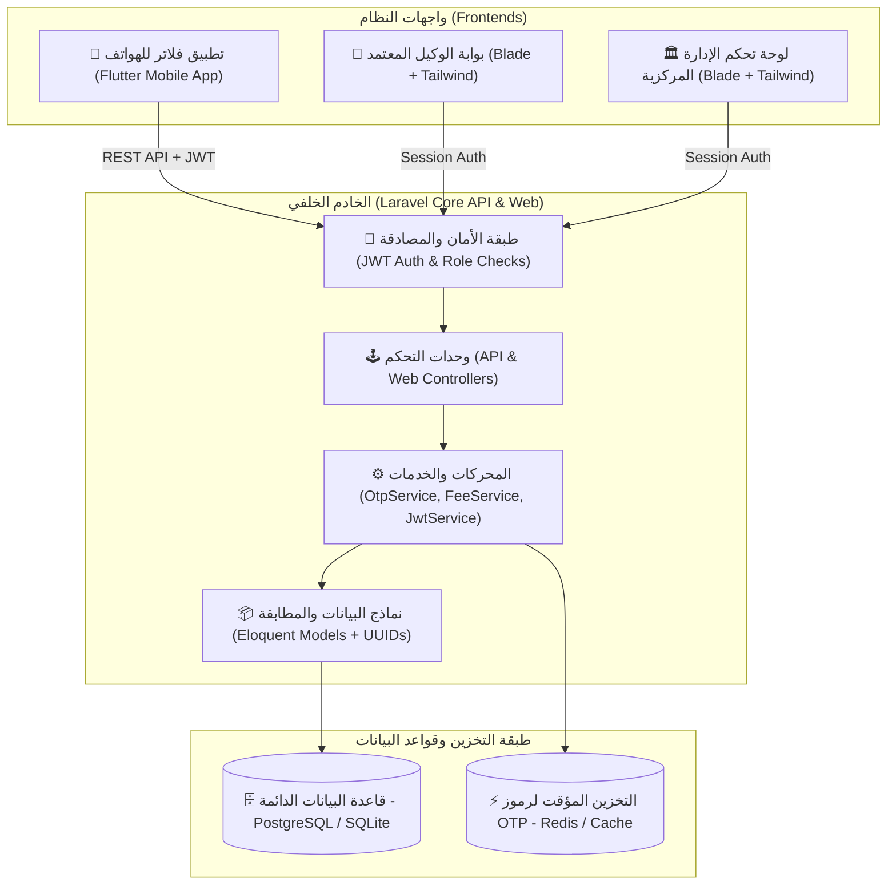
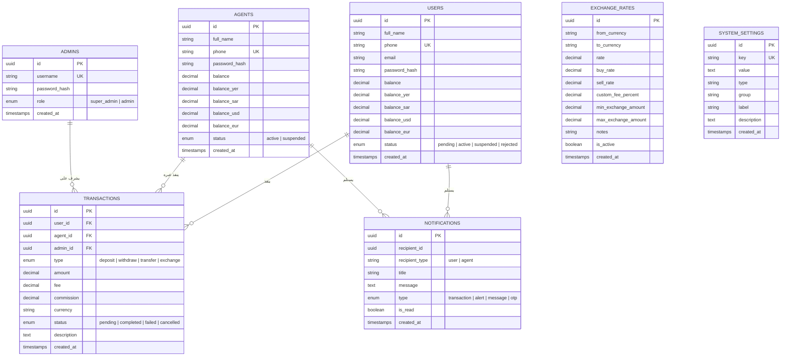
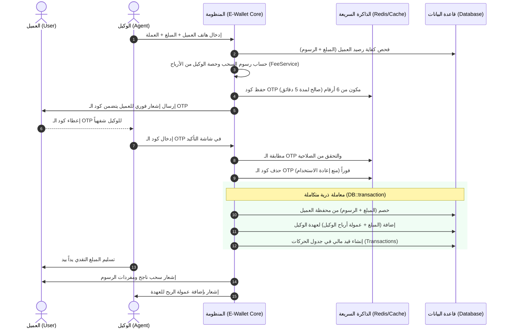

# 📱 دليل وتوثيق منظومة المحفظة الإلكترونية المتكاملة (E-Wallet Core Platform)

---

## 📑 فهرس المحتويات (Table of Contents)

1. [نظرة عامة عن المنظومة (Project Overview)](#1-نظرة-عامة-عن-المنظومة-project-overview)
2. [المعمارية والتقنيات المستخدمة (Architecture &amp; Tech Stack)](#2-المعمارية-والتقنيات-المستخدمة-architecture--tech-stack)
3. [هيكلية ملفات المشروع الشاملة (Directory Structure)](#3-هيكلية-ملفات-المشروع-الشاملة-directory-structure)
4. [مخطط قاعدة البيانات ونماذج البيانات (Database Schema &amp; Models)](#4-مخطط-قاعدة-البيانات-ونماذج-البيانات-database-schema--models)
5. [أطراف النظام والصلاحيات (Roles &amp; Actors)](#5-أطراف-النظام-والصلاحيات-roles--actors)
6. [محرك العمليات المالية والأمان (Financial &amp; Security Engines)](#6-محرك-العمليات-المالية-والأمان-financial--security-engines)
7. [محرك الصرف المفتوح والعمولات التلقائية (Dynamic Exchange &amp; Fee Engine)](#7-محرك-الصرف-المفتوح-والعمولات-التلقائية-dynamic-exchange--fee-engine)
8. [توثيق واجهات برمجة التطبيقات (REST APIs Reference)](#8-توثيق-واجهات-برمجة-التطبيقات-rest-apis-reference)
9. [لوحات تحكم وبوابات الويب (Web Interfaces &amp; Portals)](#9-لوحات-تحكم-وبوابات-الويب-web-interfaces--portals)
10. [دليل التثبيت والتشغيل السريع (Installation &amp; Quickstart Guide)](#10-دليل-التثبيت-والتشغيل-السريع-installation--quickstart-guide)

---

## 1. نظرة عامة عن المنظومة (Project Overview)

منظومة **E-Wallet Core Platform** هي منصة مالية رقمية متكاملة عالية الأمان تتبع معمارية **(Client-Server Architecture)** وتوفر حلاً مصرفياً شاملاً للمحافظ الإلكترونية وشبكات الصرافة والوكلاء المعتمدين.

### ✨ الركائز الأساسية للمشروع:

* **الأمان المالي المطلق (ACID Compliance):** تنفيذ جميع العمليات المالية بحركات ذرية غير قابلة للتجزئة باستخدام `DB::transaction()`.
* **تعدد العملات والسيولة (Multi-Currency Vaults):** دعم كامل لأرصدة متعددة العملات (YER, SAR, USD, EUR, AED، وغيرها) للعملاء والوكلاء ومؤشرات النظام.
* **نظام الوكلاء وشبكة الصرافة (Cash-In / Cash-Out Network):** إيداع نقدي فوري، وسحب نقدي آمن محمي بنظام التحقق بخطوتين عبر رموز **OTP** صالحة لـ 5 دقائق فقط تُدار عبر الذاكرة السريعة مع احتساب أرباح وعمولات الوكلاء تلقائياً.
* **محرك الصرف والمصارفة الديناميكي (Dynamic Currency Exchange Engine):** إمكانية إضافة وتعديل أي أزواج عملات في العالم فورياً مع تحديد أسعار الصرف وهوامش الشراء والبيع والعمولات المخصصة لكل زوج.
* **الرقابة الإدارية المركزية:** نظام تدقيق صارم لا يسمح بتفعيل حسابات العملاء إلا بعد الموافقة الإدارية (`Pending Approval Queue`)، مع لوحة تحكم تمنح رؤية لحظية لكافة التدفقات النقدية وسجل الحركات وسندات التحويل.

---

## 2. المعمارية والتقنيات المستخدمة (Architecture & Tech Stack)



| المكون (Component)                             | التقنية المختارة (Technology)       | الوظيفة والدور في النظام                                                                                   |
| ---------------------------------------------------- | -------------------------------------------------- | ------------------------------------------------------------------------------------------------------------------------------- |
| **الخلفية البرمجية (Backend)**  | Laravel 11/12 (PHP 8.2+)                           | معالجة المنطق المالي، إدارة مسارات الـ API وبوابات الويب.                          |
| **المصادقة (Authentication)**          | JWT (JSON Web Tokens) & Session Guard              | مصادقة تطبيق فلاتر الموبايل وجلسات المشرفين والوكلاء.                             |
| **قواعد البيانات (Database)**     | SQLite / PostgreSQL                                | التخزين الدائم للبيانات المالية مع استخدام مفاتيح`UUID` لكافة السجلات. |
| **الذاكرة السريعة (Cache)**      | Redis / Framework Cache Engine                     | إدارة وتوليد رموز OTP المؤقتة بمهلة زمنية (TTL) تبلغ 300 ثانية (5 دقائق).         |
| **واجهات الويب (Frontend Web)**     | Laravel Blade + Tailwind CSS (Light FinTech Theme) | لوحة تحكم عصرية متجاوبة للإدارة وبوابة الوكيل.                                           |
| **واجهات الموبايل (Mobile App)** | Flutter (Dart)                                     | تطبيق الهواتف الذكية للعميل النهائي يتواصل عبر REST API.                                |

---

## 3. هيكلية ملفات المشروع الشاملة (Directory Structure)

```
ewallet-backend/
├── app/
│   ├── Http/
│   │   ├── Controllers/
│   │   │   ├── Api/
│   │   │   │   ├── AuthController.php          # مصادقة عملاء تطبيق الموبايل (تسجيل، دخول، ملف شخصي)
│   │   │   │   ├── WalletController.php        # عمليات المحفظة (أرصدة، تحويل P2P، مصارفة العملات، سجل)
│   │   │   │   ├── NotificationController.php  # جلب الإشعارات وقراءتها لتطبيق الموبايل
│   │   │   │   ├── AgentApiController.php      # APIs نقاط البيع للوكيل (إيداع وسحب بالـ OTP)
│   │   │   │   └── AdminApiController.php      # APIs الإدارة للموافقة على المستخدمين
│   │   │   └── Web/
│   │   │       ├── AdminWebController.php      # تحكم لوحة الإدارة (موافقة مستخدمين، وكلاء، تسويات، إعدادات)
│   │   │       └── AgentWebController.php      # تحكم بوابة الوكيل (إيداع، سحب، OTP، سجل، إشعارات)
│   │   └── Middleware/
│   │       ├── JwtAuth.php                     # فحص وتدقيق توكنات JWT على مسارات الـ API
│   │       ├── RoleCheck.php                   # التحقق من صلاحيات المشرفين والوكلاء في الويب
│   │       └── CheckUserStatus.php             # حظر الحسابات المعلقة والموقوفة من العمليات المالية
│   ├── Models/
│   │   ├── User.php                            # نموذج العميل والمحافظ متعددة العملات
│   │   ├── Agent.php                           # نموذج الوكيل المعتمد وخزينة العهدة
│   │   ├── Admin.php                           # نموذج مشرفي الإدارة
│   │   ├── Transaction.php                     # سجل دفتر الأستاذ العام (Ledger) والعمولات
│   │   ├── Notification.php                    # الإشعارات مع علاقة تعدد شكلي (MorphTo)
│   │   ├── ExchangeRate.php                    # أزواج الصرف الديناميكية والعمولات المخصصة
│   │   └── SystemSetting.php                   # الإعدادات العامة والسياسات والأسقف المالية
│   ├── Services/
│   │   ├── JwtService.php                      # توليد وفك تشفير توكنات JWT
│   │   ├── OtpService.php                      # توليد والتحقق من رموز OTP وحفظها بالذاكرة
│   │   └── FeeService.php                      # حساب رسوم التحويل والسحب وأرباح الوكلاء وصرف العملات
│   └── Providers/
│       └── AppServiceProvider.php              # تسجيل علاقات MorphMap للكيانات
├── database/
│   ├── migrations/
│   │   ├── 0001_01_01_000000_create_users_table.php
│   │   ├── 2026_01_01_000001_create_agents_table.php
│   │   ├── 2026_01_01_000002_create_admins_table.php
│   │   ├── 2026_01_01_000003_create_transactions_table.php
│   │   ├── 2026_01_01_000004_create_notifications_table.php
│   │   ├── 2026_01_01_000005_create_exchange_rates_table.php
│   │   └── 2026_01_01_000006_create_system_settings_table.php
│   └── seeders/
│       └── DatabaseSeeder.php                  # بذر البيانات التجريبية وأسعار الصرف والإعدادات
├── resources/
│   └── views/
│       ├── layouts/
│       │   ├── admin.blade.php                 # القالب العام للوحة الإدارة (Sidebar + Header)
│       │   └── agent.blade.php                 # القالب العام لبوابة الوكيل (Live Header + Bell Badge)
│       ├── admin/
│       │   ├── dashboard.blade.php             # الرقابة المركزية، بطاقات السيولة، وطابور الموافقة
│       │   ├── users.blade.php                 # دليل العملاء وتعديل الحالات
│       │   ├── user_details.blade.php          # كشف حساب العميل الفردي وسجل حركاته
│       │   ├── agents.blade.php                # دليل الوكلاء وتسجيل وكيل جديد بالعهدة
│       │   ├── agent_details.blade.php         # الملف المالي للوكيل وخزينته وتغذيته المباشرة
│       │   ├── adjust_balance.blade.php        # التسويات المالية وتغذية الحسابات المباشرة
│       │   ├── transactions.blade.php          # دفتر الأستاذ العام وسندات العمليات الرقمية
│       │   ├── notifications.blade.php         # مركز بث الإشعارات للعملاء والوكلاء
│       │   ├── settings.blade.php              # محرك الصرف الديناميكي وإعدادات الرسوم والأسقف
│       │   └── login.blade.php                 # تسجيل دخول المشرف
│       └── agent/
│           ├── dashboard.blade.php             # لوحة الوكيل وبطاقات العهدة النقدية
│           ├── deposit.blade.php               # محطة الإيداع النقدي للعميل
│           ├── withdraw.blade.php              # محطة السحب النقدي - الخطوة 1
│           ├── withdraw_confirm.blade.php      # تأكيد السحب بالـ OTP وتوزيع العمولات - الخطوة 2
│           ├── transactions.blade.php          # سجل عمليات المركز المعتمد
│           ├── notifications.blade.php         # مركز إشعارات الوكيل
│           └── login.blade.php                 # تسجيل دخول الوكيل
└── routes/
    ├── api.php                                 # مسارات REST APIs لتطبيق الموبايل
    └── web.php                                 # مسارات بوابات الويب (Admin & Agent)
```

---

## 4. مخطط قاعدة البيانات ونماذج البيانات (Database Schema & Models)

جميع الجداول تستخدم معرفات **UUID** فريدة مكونة من 36 حرفاً لضمان سرية وأمان السجلات المالية:



---

## 5. أطراف النظام والصلاحيات (Roles & Actors)

### 1️⃣ العميل (End-User - تطبيق الموبايل)

* **التسجيل الأولي:** يسجل حسابه وتكون حالته افتراضياً `pending` (معلق).
* **الحظر الوقائي:** لا يمكنه تنفيذ أي عملية مالية (تحويل، سحب، مصارفة) حتى يوافق الأدمن على حسابه.
* **الاستعلام والمحافظ:** يستعرض أرصدته بالعملات المختلفة في شاشة موحدة.
* **التحويلات:** يحول لأي مستخدم آخر بالعملة المطلوبة مع اقتطاع الرسوم تلقائياً.
* **صرف العملات:** يستبدل عملة بأخرى داخل محفظته بالسعر اللحظي.
* **استلام الـ OTP:** يصله رمز التحقق اللحظي في إشعارات التطبيق عند محاولة سحب كاش عبر الوكيل.

### 2️⃣ الوكيل المعتمد (Agent - بوابة الويب)

* **لوحة الصرافة:** استعراض رصيد العهدة المتوفرة لديه بكل عملة بشكل مستقل.
* **الإيداع النقدي (Cash-In):** إيداع رصيد للعميل بخصم من عهدة الوكيل وإضافتها لرصيد العميل.
* **السحب النقدي (Cash-Out):** سحب مبلغ من العميل عبر التحقق من كود الـ OTP، مع **إيداع عمولة ربح الوكيل فورياً في عهدته**.
* **سجل العمليات والإشعارات:** متابعة كافة الحركات المنفذة وجرس إشعارات حي.

### 3️⃣ مشرف النظام (Admin - لوحة الإدارة المركزية)

* **الموافقة على الحسابات:** مراجعة طلبات التسجيل المعلقة والموافقة عليها أو رفضها أو تعليقها.
* **إدارة الوكلاء وتغذية العهد:** إنشاء وكلاء جدد بتحديد عهدة افتتاحية بكل عملة، وتغذية أو استرداد عهدة الوكيل مباشرة.
* **محرك الصرف والعمولات:** إضافة أزواج عملات جديدة، تعديل أسعار الصرف، وضبط نسب الرسوم وأسقف العمليات.
* **دفتر الأستاذ العام (Audit Ledger):** مراقبة شاملة لكافة العمليات المنفذة في النظام مع عرض السند الرقمي المعتمد.
* **بث الإشعارات:** إرسال إشعارات جماعية لكافة المستخدمين أو الوكلاء أو مستلم محدد.

---

## 6. محرك العمليات المالية والأمان (Financial & Security Engines)

### 🔄 أ. دورة السحب النقدي بالتحقق الثنائي والعمولات (Two-Step Cash-Out with OTP & Profit)



---

## 7. محرك الصرف المفتوح والعمولات التلقائية (Dynamic Exchange & Fee Engine)

### 💱 أ. المصارفة المفتوحة (Dynamic Currency Exchange):

* لا توجد قيود على نوع أو عدد العملات في النظام.
* يتيح جدول `exchange_rates` تعريف أي زوج عملات (مثل: `SAR -> YER`, `USD -> YER`, `EUR -> USD`, `AED -> SAR`, `KWD -> USD`...).
* يدعم النظام:
  - **سعر الصرف المباشر (Direct Rate).**
  - **سعر الشراء وسعر البيع (Buy/Sell Spread).**
  - **عمولة الصرف المخصصة للزوج (Custom Pair Fee %):** إذا حُددت عمولة خاصة لزوج معين تُطبق، وإلا يطبق الرسم العام للنظام.
  - **الحدود الدنيا والقصوى لمبلغ المصارفة لكل زوج.**

### 💰 ب. معادلات احتساب الرسوم والعمولات (`FeeService`):

1. **رسوم التحويل بين العملاء (P2P Transfer Fee):**
   $$
   \text{Fee} = (\text{Amount} \times \frac{\text{TransferFee\%}}{100}) + \text{FixedFee}
   $$
2. **رسوم السحب النقدي (Withdrawal Fee):**
   $$
   \text{Total Fee} = \text{Amount} \times \frac{\text{WithdrawalFee\%}}{100}
   $$
3. **أرباح الوكيل المعتمد (Agent Profit Commission Share):**
   $$
   \text{Agent Commission} = \text{Total Fee} \times \frac{\text{AgentShare\%}}{100}
   $$
4. **صافي عائد المنظومة من السحب (Platform Net Revenue):**
   $$
   \text{Platform Revenue} = \text{Total Fee} - \text{Agent Commission}
   $$
5. **عمولة صرف وتحويل العملات (Exchange Fee):**
   $$
   \text{Exchange Fee} = (\text{Amount} \times \text{Rate}) \times \frac{\text{EffectiveFee\%}}{100}
   $$

---

## 8. توثيق واجهات برمجة التطبيقات (REST APIs Reference)

جميع ردود الـ API تتبع معيار JSON الموحد:

```json
{
  "success": true,
  "message": "نص الرسالة التوضيحية",
  "data": { ... }
}
```

### 📋 قائمة الـ Endpoints الأساسية:

#### 1. المصادقة والحسابات (Authentication & Account):

| الطريقة | المسار              | الوصف                                                             | المصادقة المطلوبة |
| -------------- | ------------------------- | ---------------------------------------------------------------------- | --------------------------------- |
| `POST`       | `/api/v1/auth/register` | تسجيل حساب عميل جديد (ينشأ بحالة`pending`) | عام (Public)                   |
| `POST`       | `/api/v1/auth/login`    | تسجيل الدخول وتوليد توكن`JWT`                   | عام (Public)                   |
| `GET`        | `/api/v1/auth/profile`  | استرجاع الملف الشخصي وحالة الحساب         | Bearer JWT                        |
| `POST`       | `/api/v1/auth/logout`   | تسجيل الخروج وإلغاء التوكن                      | Bearer JWT                        |

#### 2. المحفظة والعمليات المالية (Wallet & Transfers):

| الطريقة | المسار                        | الوصف                                                                             | المصادقة المطلوبة |
| -------------- | ----------------------------------- | -------------------------------------------------------------------------------------- | --------------------------------- |
| `GET`        | `/api/v1/wallet/balance`          | استرجاع أرصدة العميل بكافة العملات                       | Bearer JWT + Active               |
| `POST`       | `/api/v1/wallet/transfer`         | تحويل رصيد لمستخدم آخر مع احتساب الرسوم               | Bearer JWT + Active               |
| `GET`        | `/api/v1/wallet/exchange-rates`   | جلب قائمة أسعار الصرف الحية والنشطة                      | Bearer JWT + Active               |
| `POST`       | `/api/v1/wallet/exchange/preview` | معاينة ناتج الصرف والعمولة والصافي قبل التنفيذ | Bearer JWT + Active               |
| `POST`       | `/api/v1/wallet/exchange`         | تنفيذ صرف العملات واستبدال الأرصدة                       | Bearer JWT + Active               |
| `GET`        | `/api/v1/wallet/transactions`     | استرجاع سجل العمليات مع دعم الفلترة                      | Bearer JWT + Active               |

#### 3. الإشعارات (In-App Notifications):

| الطريقة | المسار                           | الوصف                                                        | المصادقة المطلوبة |
| -------------- | -------------------------------------- | ----------------------------------------------------------------- | --------------------------------- |
| `GET`        | `/api/v1/notifications`              | استرجاع قائمة الإشعارات والتنبيهات | Bearer JWT                        |
| `GET`        | `/api/v1/notifications/unread-count` | عدد الإشعارات غير المقروءة                 | Bearer JWT                        |
| `POST`       | `/api/v1/notifications/{id}/read`    | تحديد إشعار معين كمقروء                       | Bearer JWT                        |
| `POST`       | `/api/v1/notifications/read-all`     | تحديد جميع الإشعارات كمقروءة             | Bearer JWT                        |

#### 4. عمليات نقاط البيع للوكيل (Agent POS Endpoints):

| الطريقة | المسار                       | الوصف                                                       | المصادقة المطلوبة |
| -------------- | ---------------------------------- | ---------------------------------------------------------------- | --------------------------------- |
| `POST`       | `/api/v1/agent/login`            | تسجيل دخول الوكيل عبر الـ API               | عام (Public)                   |
| `POST`       | `/api/v1/agent/deposit`          | تنفيذ إيداع نقدي لحساب عميل               | Bearer JWT (Agent)                |
| `POST`       | `/api/v1/agent/withdraw/request` | طلب سحب نقدي وإرسال رمز OTP للعميل      | Bearer JWT (Agent)                |
| `POST`       | `/api/v1/agent/withdraw/verify`  | تأكيد السحب بالـ OTP وتوزيع العمولات | Bearer JWT (Agent)                |

---

## 9. لوحات تحكم وبوابات الويب (Web Interfaces & Portals)

### 🏛️ أ. لوحة تحكم الإدارة المركزية (`/admin/*`):

1. **الرئيسية (`/admin/dashboard`):**
   - مؤشرات السيولة التراكمية في النظام لكل عملة (YER, SAR, USD, EUR).
   - حجم التداول اليومي وعدد العمليات.
   - **طابور الموافقة الفورية على طلبات التسجيل المعلقة (`Pending Queue`)**.
2. **دليل العملاء (`/admin/users`):**
   - فحص بيانات العملاء، تعديل الحالات (`تفعيل`, `تعليق`, `رفض`).
   - فتح كشف حساب العميل الشامل وسجل حركاته الفردية.
3. **شبكة الوكلاء المعتمدين (`/admin/agents`):**
   - تسجيل مركز وكيل جديد وتغذية العهدة الافتتاحية بكل عملة.
   - صفحة الملف المالي للوكيل (`/admin/agents/{id}`) مع محطة التغذية والخصم الفوري للعهدة.
4. **التسويات المباشرة (`/admin/balance-adjustment`):**
   - تغذية أو خصم إداري مباشر من أي عميل أو وكيل مع تسجيل السبب الرقابي.
5. **دفتر الأستاذ العام (`/admin/transactions`):**
   - تتبع كل الحركات المالية مع فلترة العملات ونوع الحركة وبحث بالبيان والاسم.
   - **زر السند الرقمي التفاعلي (`showTxDetails Modal`)** لعرض إيصال الحركة بكامل تفاصيلها.
6. **مركز بث الإشعارات (`/admin/notifications`):**
   - بث تنبيه فوري لكافة العملاء، أو كافة الوكلاء، أو مستخدم/وكيل محدد.
7. **إعدادات الصرف والعمولات (`/admin/settings`):**
   - إضافة أي زوج عملات ديناميكي، تعديل أسعار الصرف، أسعار الشراء والبيع، والعمولات المخصصة.
   - تعديل رسوم التحويل والسحب وأرباح الوكلاء والأسقف اليومية.

### 🏪 ب. بوابة الوكيل المعتمد (`/agent/*`):

1. **الرئيسية (`/agent/dashboard`):** بطاقات أرصدة العهدة النقدية المتوفرة لدى الوكيل بالعملات.
2. **شريط الهيدر الذكي:** عرض الأرصدة الحية وجرس الإشعارات مع عداد الإشعارات الجديدة النابض (`Pulse`).
3. **محطة الإيداع النقدي (`/agent/deposit`):** إيداع فوري للعميل برقم الهاتف وتحديد العملة.
4. **محطة السحب النقدي (`/agent/withdraw`):** طلب السحب بخطوتين وتأكيد الـ OTP مع عرض تفاصيل الرسوم وأرباح عمولة الوكيل.
5. **سجل عمليات المركز (`/agent/transactions`):** كشف حساب المركز مع فلترة العملات.
6. **مركز إشعارات الوكيل (`/agent/notifications`):** استعراض التنبيهات وإشعارات الأرباح وتحديدها كمقروءة.

---

## 10. دليل التثبيت والتشغيل السريع (Installation & Quickstart Guide)

### ⚙️ المتطلبات الأساسية:

* PHP 8.2 أو أحدث مع امتدادات (`pdo`, `sqlite`/`pgsql`, `mbstring`, `openssl`, `curl`).
* Composer.
* Node.js & NPM (لتجميع التنسيقات عند الحاجة).

### 🚀 خطوات التشغيل خطوة بخطوة:

```bash
# 1. الانتقال لمجلد المشروع
cd d:/WALLET/ewallet-backend

# 2. تثبيت حزم الـ PHP
composer install

# 3. إعداد ملف البيئة
cp .env.example .env
php artisan key:generate

# 4. بناء قاعدة البيانات وبذر البيانات الافتراضية التجريبية
php artisan migrate:fresh --seed

# 5. تشغيل السيرفر المحلي
php artisan serve
```

---

### 🔑 بيانات الدخول الافتراضية الجاهزة للاختبار (Default Credentials):

#### 1. مدير النظام (Super Admin):

* **الرابط:** `http://127.0.0.1:8000/admin/login`
* **اسم المستخدم:** `admin`
* **كلمة المرور:** `admin123`

#### 2. الوكيل المعتمد (Authorized Agent):

* **الرابط:** `http://127.0.0.1:8000/agent/login`
* **رقم الهاتف:** `777000111`
* **كلمة المرور:** `agent123`

#### 3. العميل النشط (Active User - تطبيق الموبايل):

* **رقم الهاتف:** `777111222`
* **كلمة المرور:** `user123`

---

## 🔒 ملخص معايير الأمان المطبقة:

1. **لا توجد عمليات بنكية عائمة:** جميع الخصومات والإيداعات تتم داخل `DB::transaction()` لضمان عدم ضياع أي مبلغ.
2. **حماية من إعادة استخدام الـ OTP (Anti-Replay Attack):** يتم إتلاف رمز التحقق فور استخدامه الناجح لأول مرة، وتنقضي صلاحيته بعد 300 ثانية.
3. **تشفير كلمات المرور:** استخدام خوارزمية `Bcrypt` الحديثة لتشفير جميع الحسابات.
4. **حظر الحسابات المعلقة:** فحص إجباري لحالة الحساب قبل السماح بأي حركة مالية.
5. **مفاتيح غير قابلة للتخمين:** اعتماد `UUID v4` في كافة الجداول بدلاً من الأرقام التسلسلية المتتالية.

---

> 💡 **ملاحظة:** هذا التوثيق يمثل المرجع المعماري الشامل لكامل الكود البرمجي للمنظومة، ويغطي كافة أجزاء الـ Backend، الـ REST APIs، ولوحات تحكم الـ Web Blade.
