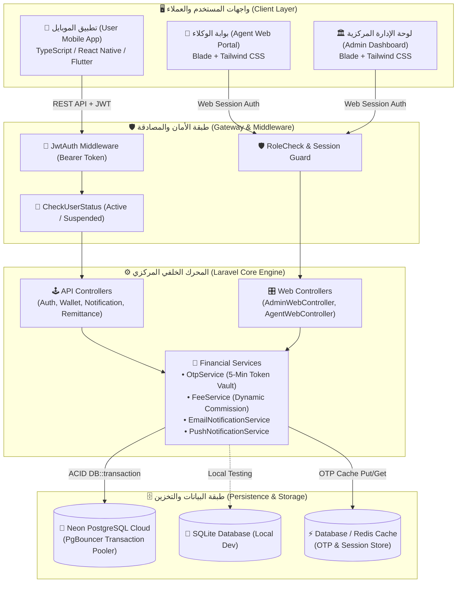

# 💳 منظومة المحفظة الإلكترونية المتكاملة (E-Wallet Core Platform)

<div align="center">


<p align="center">
  <strong>منظومة مالية ومصرفية رقمية متكاملة عالية الأمان (Bank-Grade Digital Wallet Platform)</strong><br>
  مبنية وفق معمارية الخادم والعميل (Client-Server Architecture)، وتوفر بيئة شاملة لإدارة الحسابات النقدية، تداول الأموال الفوري، السحب والإيداع عبر شبكة الوكلاء، الحوالات المالية السريعة، محرك المصارفة الديناميكي، وسندات العمليات المصرفية التفاعلية.
</p>

[🌟 الميزات الرئيسية](#-الميزات-الرئيسية-key-capabilities) •
[🏛️ المعمارية والتقنيات](#-المعمارية-والتقنيات-architecture--tech-stack) •
[💼 أطراف النظام والصلاحيات](#-أطراف-النظام-والصلاحيات-roles--actors) •
[⚙️ الأنظمة المصرفية المدمجة](#-الأنظمة-المصرفية-المدمجة-core-subsystems) •
[🗄️ مخطط قاعدة البيانات](#️-مخطط-قاعدة-البيانات-database-schema) •
[🚀 دليل التشغيل والنشر](#-دليل-التشغيل-والنشر-deployment--setup) •
[📚 توثيق واجهات الـ API](#-توثيق-واجهات-برمجة-التطبيقات-rest-apis)

</div>

---

## 🌟 الميزات الرئيسية (Key Capabilities)

* 🛡️ **معايير الأمان المالي والمصرفي (ACID Compliance & Concurrency):**
  * تغليف جميع الحركات المالية (إيداع، سحب، تحويل، مصارفة، تسوية) داخل `DB::transaction()`.
  * حماية الأرصدة من التضارب في أجزاء الثانية وقفل الصفوف تشاؤمياً (`lockForUpdate`).
  * استخدام معرّفات فريدة عالمياً (**UUID**) لكافة الجداول كبديل للأرقام المتسلسلة لتعزيز الخصوصية والأمان.
* 👥 **سلسلة التحقق والاعتماد الإداري (KYC & Account Verification):**
  * جميع حسابات العملاء الجديدة تنشأ تلقائياً في حالة تعليق (`pending`) ولا يمكنها تنفيذ أي حركة مالية إلا بعد مراجعة المشرف واعتماد الحساب (`active`).
* 🏧 **شبكة الوكلاء والسحب النقدي الآمن (2-Step OTP Cash-Out Network):**
  * آلية سحب كاش صارمة من خطوتين: يطلب الوكيل العملية، فيقوم السيرفر بتوليد رمز **OTP** مشفر لمدة 5 دقائق يصل مباشرة لهاتف العميل.
  * لا يظهر الرمز للوكيل إطلاقاً لضمان سرية التفويض.
  * احتساب فوري لأرباح وعمولات الوكيل وتعويض النقدية المسلمة وإيداعها مباشرة في عهدته الإلكترونية.
* 💸 **شبكة صرف الحوالات المالية (Remittance & Cash Payout Gateway):**
  * نظام حوالات مالية داخلية برقم حوالة فريد، تتيح للوكلاء المعتمدين صرف الحوالات النقدية للمستفيدين بعد التحقق من إثبات الهوية والرقم السري مع إصدار سند صرف رسمي.
* 💱 **محرك المصارفة الحية وتعدد العملات (Dynamic Currency Exchange Engine):**
  * دعم كامل للأرصدة المتعددة (`SAR`، `YER`، `USD`، `EUR`).
  * لوحة تحكم إدارية تمكن المشرف من تعديل أسعار الصرف وهوامش الشراء والبيع والعمولات اللحظية لأي زوج عملات.
* 🧾 **نظام السندات المالية التفاعلية (FinTech Printable Receipts Modals):**
  * توليد سندات قبض وصرف وتحويل فورية مزودة بباركود، أرقام مرجعية، تفاصيل الأطراف، مع دعم كامل للطباعة المباشرة والتصدير.
* ⚡ **توافق سحابي هجين (Serverless & PgBouncer Cloud Optimization):**
  * يعمل بكفاءة على السيرفرات المحلية وسحابياً على منصة **Vercel Serverless** مع قاعدة بيانات **Neon PostgreSQL** عبر وسيط الاتصالات **PgBouncer** بتقنية استعلامات متزامنة (`PDO::ATTR_EMULATE_PREPARES`).

---

## 🏛️ المعمارية والتقنيات (Architecture & Tech Stack)

### 📊 مخطط تدفق النظام (Architecture Flowchart)



### 🛠️ جدول الحزمة التقنية (Technology Matrix)

| الطبقة (Layer) | التقنية (Technology) | التفاصيل والمميزات |
| :--- | :--- | :--- |
| **الخادم الخلفي (Backend)** | **Laravel 12 / PHP 8.2+** | هيكلية MVC نظيفة، فروع متحكمات منفصلة للويب والـ API، دعم المعاملات المالية المجمعة. |
| **قواعد البيانات (Databases)** | **Neon PostgreSQL & SQLite** | دعم البيئة الهجينة (تطوير محلي سريع ونشر سحابي فائق السرعة مع PgBouncer). |
| **الأمان والمصادقة (Auth)** | **JWT & Stateful Web Sessions** | `firebase/php-jwt` لتأمين الـ APIs، وجلسات مؤمنة بـ CSRF لبوابات الويب. |
| **الكاش والـ OTP** | **Database / Redis Cache Store** | تخزين مؤقت لرموز التحقق لمدة 300 ثانية مع الإتلاف التلقائي فور الاستخدام لمنع هجمات التكرار (Replay Attacks). |
| **الواجهات الإدارية (Web UI)** | **Laravel Blade + Tailwind CSS** | واجهات مستخدم بنمط مصرفي فاتح ونظيف (Pure Light FinTech Theme) متجاوبة بالكامل مع ميكرو-تفاعلات وسندات منبثقة. |
| **تطبيقات الموبايل (Mobile)** | **React Native (Expo) / Flutter** | واجهات تطبيق عميل متجاوبة بالكامل تتصل عبر REST APIs الموحدة. |
| **الإشعارات السحابية** | **Expo Push & In-App Alerts** | إرسال تنبيهات لحظية للعمليات والسحوبات والتحويلات للعملاء والوكلاء. |

---

## 💼 أطراف النظام والصلاحيات (Roles & Actors)

```
                       ┌─────────────────────────────────────────┐
                       │        👑 مدير النظام المركزي           │
                       │             (Super Admin)               │
                       └────────────────────┬────────────────────┘
                                            │
                    ┌───────────────────────┴───────────────────────┐
                    ▼                                               ▼
     ┌─────────────────────────────┐                 ┌─────────────────────────────┐
     │      🏪 الوكيل المعتمد      │                 │      📱 المستخدم النهائي     │
     │       (Verified Agent)      │                 │         (End-User)          │
     ├─────────────────────────────┤                 ├─────────────────────────────┤
     │ • إيداع نقدي فوري           │                 │ • محفظة متعددة العملات     │
     │ • سحب كاش آمن (2-Step OTP)  │                 │ • تحويل فوري بين الحسابات   │
     │ • صرف الحوالات النقدية      │                 │ • إرسال واستعلام الحوالات   │
     │ • جني العمولات لعهدته       │                 │ • مصارفة حية بين العملات    │
     │ • سندات فورية قابلة للطباعة │                 │ • استلام كود OTP للسحب      │
     └─────────────────────────────┘                 └─────────────────────────────┘
```

### 1. مدير النظام (Central Admin):
* **لوحة القيادة والمؤشرات الحية:** مراقبة إجمالي الأرصدة المتداولة، عدد المستخدمين، الوكلاء، وحجم العمليات اليومية.
* **إدارة واعتماد العملاء (KYC Workflow):** فحص ومراجعة طلبات التسجيل المعلقة (`pending`)، تفعيل الحسابات (`active`)، تجميدها (`suspended`)، أو رفضها (`rejected`).
* **إدارة الوكلاء وخزائنهم:** إنشاء وتعيين الوكلاء المعتمدين، مراقبة سيولة الخزائن، وتعديل حالاتهم التشغيلية.
* **التسويات والتغذية المالية المباشرة (Direct Adjustments):** شحن أو خصم الأرصدة للمستخدمين أو الوكلاء لأغراض التسوية المصرفية مع إصدار سندات تغطية نظامية.
* **محرك الصرف المفتوح (Dynamic Exchange Rates):** إضافة وتعديل أزواج العملات وأسعار البيع والشراء وهوامش العمولات اللحظية.
* **مركز بث التنبيهات والإشعارات:** إرسال إشعارات موجهة لعميل محدد أو وكيل معين أو بث عام لكافة مستخدمي المنظومة.
* **سجل التدقيق الشامل (Financial Audit Trail):** استعراض والبحث في كافة حركات المنظومة بالعملة، النوع، المعرف، والتاريخ.

### 2. الوكيل المعتمد (Authorized Agent):
* **محطة الصرافة والنقدية:** إدارة رصيد عهدة الوكيل المعتمد بمختلف العملات ومتابعة الإيرادات اللحظية.
* **الإيداع النقدي للعملاء (Cash-In):** تغذية رصيد العميل مباشرة بمجرد إدخال رقم هاتفه واختيار العملة مع إصدار سند إيداع فوري.
* **السحب النقدي المؤمن (2-Step Cash-Out):**
  * إدخال رقم هاتف العميل والمبلغ المطلوب تسليمه كاش.
  * طلب كود الـ OTP (يرسل للعميل فقط ولا يظهر للوكيل).
  * في حال الخطأ برقم OTP يظل الوكيل في شاشة التأكيد لإعادة المحاولة.
  * عند التأكيد، يُخصم المبلغ من العميل، ويُعوّض الوكيل بكامل مبلغ النقدية مضافاً إليه عمولته المعتمدة فوراً في عهدته.
* **صرف الحوالات النقدية (Remittance Payout Desk):** البحث برقم الحوالة وإثبات هوية المستلم، والتحقق من صلاحيتها وصرفها نقداً للمستلم مع إضافة عمولة الوكيل وسند الصرف.

### 3. العميل النهائي (End-User - Mobile App):
* **إنشاء حساب وتأكيده:** تسجيل بيانات العميل والبقاء في حالة الانتظار حتى موافقة الإدارة.
* **إدارة المحافظ متعددة العملات:** استعراض الأرصدة بالريال اليمني، الريال السعودي، الدولار الأمريكي، واليورو.
* **التحويل المالي السريع (P2P Transfers):** تحويل فوري لأي عميل آخر باستخدام رقم الهاتف مع احتساب الرسوم بدقة.
* **إصدار الحوالات المالية واستلامها:** إرسال حوالة نقدية لشخص غير مسجل بالمنظومة مع توليد كود سري للمستلم.
* **المصارفة الذاتية (Instant Currency Swap):** تحويل الأموال بين عملات الحساب الخاصة بالعميل بأسعار الصرف الرسمية للمنظومة.
* **صندوق الإشعارات وكود الـ OTP:** استلام إشعارات الحركات المالية وأكواد التحقق لعمليات السحب النقدي.

---

## ⚙️ الأنظمة المصرفية المدمجة (Core Subsystems)

### 1. نظام محرك الرصيد متعدد العملات (Multi-Currency Vault Engine)
تخزن الأرصدة في حقول دقيقة من نوع `decimal(15, 2)` لضمان تفادي أخطاء التقريب الرياضي (Rounding Errors).
```
• balance_yer: محفظة الريال اليمني (العملة الأساسية)
• balance_sar: محفظة الريال السعودي
• balance_usd: محفظة الدولار الأمريكي
• balance_eur: محفظة اليورو
```

### 2. محرك السحب النقدي وتوليد الـ OTP (Two-Step Cash-Out Engine)
```
[1. الوكيل يطلب السحب] ──> [2. OtpService يولد رمزاً 6 أرقام] ──> [3. حفظه في الكاش لمدة 300 ثانية]
                                                                        │
[6. السيرفر يتحقق من OTP] <── [5. العميل يسلم الرمز للوكيل] <── [4. إشعار العميل بالرمز على تطبيقه]
         │
         ├──> [أ. خصم المبلغ + الرسوم من العميل]
         ├──> [ب. إيداع (المبلغ + عمولة الوكيل) في عهدة الوكيل]
         ├──> [ج. تسجيل الحركة بحالة Completed]
         └──> [د. فتح سند الصرف الرقمي الفوري]
```

### 3. نظام الحوالات المصرفية وصرف النقدية (Remittances Subsystem)
يولد النظام كود حوالة مالي من 10 خانات غير متكرر (`RMT-XXXXXXXXXX`)، مع تسجيل بيانات المستلم (الاسم، الهاتف، المبلغ، العملة، الرسوم، وعمولة الصرف للوكيل). يمكن صرفها من أي وكيل معتمد بنقرة واحدة بعد مطابقة الهوية.

### 4. محرك أسعار الصرف المرن (Dynamic FX Engine)
يحتوي النظام على جدول مخصص `exchange_rates` يسمح بإدارة أسعار الشراء والبيع لأزواج العملات:
$$\text{المبلغ المحول} = \text{المبلغ الأصلي} \times \text{سعر التحويل} - \text{عمولة الصرف}$$

---

## 🗄️ مخطط قاعدة البيانات (Database Schema)

تعتمد المنظومة معرّفات **UUIDv7** لجميع السجلات المالية لضمان الأمان العالي وعدم إمكانية التنبؤ بمعرفات الحركات:

```
users (العملاء)
├── id (UUID, Primary Key)
├── full_name (String)
├── phone (String, Unique)
├── email (String, Nullable)
├── password_hash (String)
├── balance (Decimal 15,2 - YER Default)
├── balance_yer / balance_sar / balance_usd / balance_eur (Decimal 15,2)
├── status (Enum: pending, active, suspended, rejected)
└── push_token (String, Nullable)

agents (الوكلاء المعتمدون)
├── id (UUID, Primary Key)
├── full_name (String)
├── phone (String, Unique)
├── password_hash (String)
├── balance / balance_yer / balance_sar / balance_usd / balance_eur (Decimal 15,2)
└── status (Enum: active, suspended)

admins (مدراء النظام)
├── id (UUID, Primary Key)
├── username (String, Unique)
├── password_hash (String)
└── role (Enum: super_admin, admin)

transactions (الحركات المالية الشاملة)
├── id (UUID, Primary Key)
├── user_id (UUID Foreign, Nullable)
├── agent_id (UUID Foreign, Nullable)
├── admin_id (UUID Foreign, Nullable)
├── type (Enum: deposit, withdraw, transfer, exchange)
├── amount (Decimal 15,2)
├── fee (Decimal 15,2)
├── commission (Decimal 15,2)
├── currency (String 10)
├── status (Enum: pending, completed, failed, cancelled)
└── description (Text)

notifications (الإشعارات والتنبيهات)
├── id (UUID, Primary Key)
├── recipient_id (UUID Polymorphic)
├── recipient_type (Enum: user, agent)
├── title (String)
├── message (Text)
├── type (Enum: transaction, alert, message, otp)
└── is_read (Boolean)

remittances (الحوالات المالية)
├── id (UUID, Primary Key)
├── remittance_code (String, Unique)
├── sender_id (UUID Foreign)
├── recipient_name (String)
├── recipient_phone (String)
├── amount (Decimal 15,2)
├── currency (String)
├── fee (Decimal 15,2)
├── agent_commission (Decimal 15,2)
├── status (Enum: pending, paid, cancelled)
└── paid_by_agent_id (UUID Foreign, Nullable)
```

---

## 🚀 دليل التشغيل والنشر (Deployment & Setup)

### 💻 أولاً: التشغيل المحلي (Local Development):

#### 1. متطلبات البيئة:
* PHP >= 8.2 (مع الإضافات: `pdo_pgsql`, `pdo_sqlite`, `openssl`, `mbstring`, `curl`, `fileinfo`)
* Composer >= 2.2
* Node.js & NPM (لتجميع التنسيقات عند الرغبة)

#### 2. التثبيت وضبط الإعدادات:
```bash
# 1. الدخول لمجلد الباك إند
cd ewallet-backend

# 2. تثبيت الحزم والمكتبات
composer install

# 3. نسخ وتعديل ملف البيئة
cp .env.example .env

# 4. توليد مفتاح التطبيق ومفتاح JWT السري
php artisan key:generate

# 5. ترحيل قاعدة البيانات وإدراج البيانات التجريبية المعتمدة
php artisan migrate:fresh --seed

# 6. تشغيل السيرفر المحلي
php artisan serve --host=0.0.0.0 --port=8000
```

---

### ☁️ ثانياً: النشر السحابي (Cloud Deployment on Vercel & Neon PostgreSQL):

المنظومة مُجهزة بالكامل للعمل كخدمة **Serverless** بدون خادم عبر ملف [`vercel.json`](vercel.json):
* **وسيط التجميع (Neon Pooler):** تم تفعيل `\PDO::ATTR_EMULATE_PREPARES => true` في `config/database.php` للتوافق التام مع مجمّع الاتصالات **PgBouncer** الخاص بـ **Neon Tech**.
* **مجلدات التخزين المؤقتة:** تم توجيه التخزين تلقائياً إلى المسار `/tmp/storage` ليتوافق مع أنظمة الملفات المقروءة فقط (Read-only Serverless Lambdas).
* **إدارة الجلسات والكاش:** تم ضبط `SESSION_DRIVER=database` و `CACHE_STORE=database` لضمان ثبات الجلسات وأكواد الـ OTP بين الطلبات السحابية المختلفة.

---

## 🔑 الحسابات وبيانات الدخول التجريبية (Seeded Credentials)

| الطرف (Actor) | المسار والرابط (Route) | بيانات الدخول (Credentials) | الرصيد المبدئي |
| :--- | :--- | :--- | :--- |
| **👑 مدير النظام (Admin)** | `/admin/login` | **المستخدم:** `admin`<br>**كلمة المرور:** `admin123` | كامل صلاحيات التحكم |
| **🏪 الوكيل المعتمد (Agent)** | `/agent/login` | **الهاتف:** `777000111`<br>**كلمة المرور:** `agent123` | عهدة نقدية بكل العملات |
| **📱 العميل النشط (Active User)** | عبر الـ REST API / التطبيق | **الهاتف:** `771577165` أو `777111222`<br>**كلمة المرور:** `user123` | رصيد بالريال والدولار والسعودي |
| **⏳ العميل المعلق (Pending)** | عبر الـ REST API / التطبيق | **الهاتف:** `777333444`<br>**كلمة المرور:** `user123` | رصيد 0.00 (معلق الموافقة) |

---

## 📚 توثيق واجهات برمجة التطبيقات (REST APIs)

جميع ردود الـ API موحدة وتتبع العقد البرمجي التالي بصيغة **JSON**:
```json
{
  "success": true,
  "message": "نص وصفي لحالة العملية",
  "data": { ... }
}
```

### ملخص الـ Endpoints الرئيسية:

| المسار (Endpoint) | الطريقة (Method) | المصادقة (Auth) | الوظيفة والدور |
| :--- | :---: | :---: | :--- |
| `/api/auth/register` | `POST` | عام | تسجيل حساب عميل جديد (ينشأ بحالة `pending`). |
| `/api/auth/login` | `POST` | عام | تسجيل الدخول وتوليد رمز Bearer JWT Token. |
| `/api/auth/profile` | `GET` | Bearer Token | جلب بيانات الملف الشخصي والأرصدة بكافة العملات. |
| `/api/wallet/balance` | `GET` | Bearer Token | الاستعلام اللحظي عن تفاصيل أرصدة المحفظة. |
| `/api/wallet/transfer` | `POST` | Bearer Token | تحويل مبلغ مالي لمستخدم آخر باستخدام رقم الهاتف. |
| `/api/wallet/exchange` | `POST` | Bearer Token | مصارفة وتحويل فوري بين عملات محفظة المستخدم. |
| `/api/wallet/transactions` | `GET` | Bearer Token | استعراض سجل الحركات المالية وكشوفات الحساب. |
| `/api/remittances/send` | `POST` | Bearer Token | إنشاء وإرسال حوالة مالية نقدية بالاسم ورقم الهاتف. |
| `/api/remittances/history` | `GET` | Bearer Token | تتبع الحوالات الصادرة وحالات صرفها. |
| `/api/notifications` | `GET` | Bearer Token | جلب قائمة الإشعارات ورموز الـ OTP المستلمة. |
| `/api/notifications/register-token` | `POST` | Bearer Token | تسجيل رمز جهاز الموبايل للإشعارات السحابية. |

---

## 📄 رخصة الاستخدام والملكية الفكرية (License)

تم تطوير هذا النظام المتكامل كمنظومة مالية مصرفية رقمية تطبيقية ومطابقة لأعلى المعايير البرمجية والأكاديمية العالمية. جميع الحقوق محفوظة © 2026.
