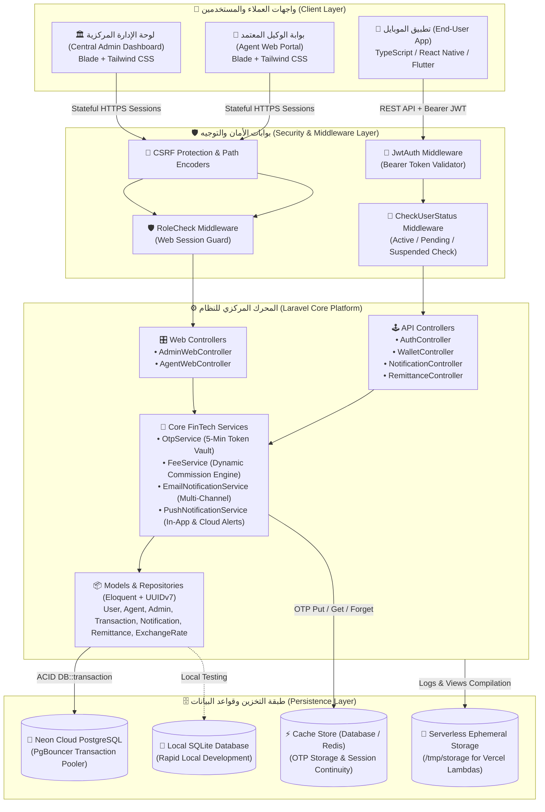
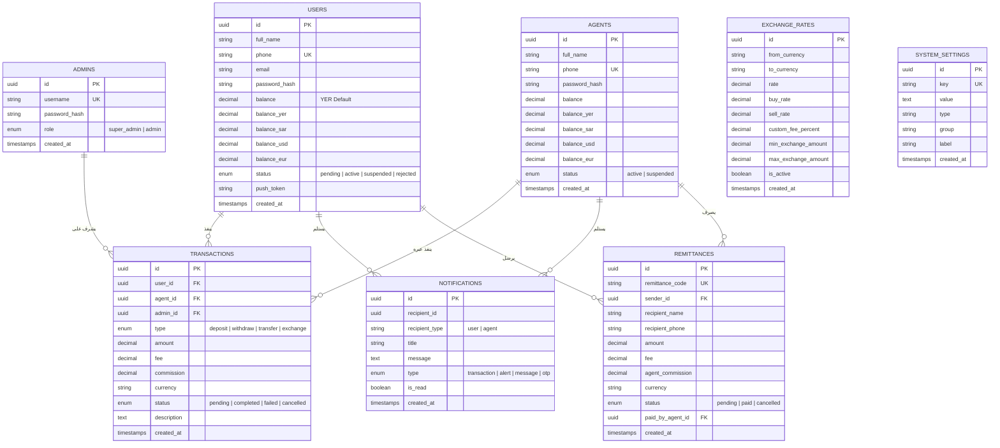
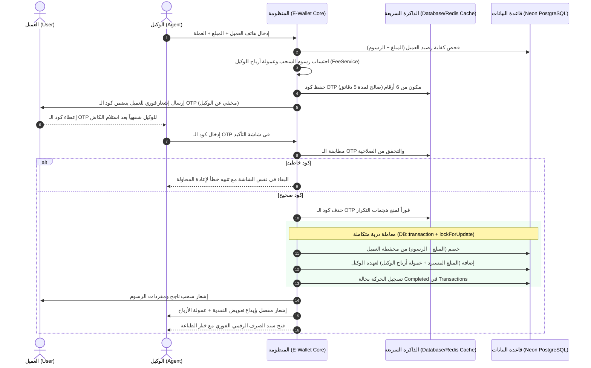

# 💳 منظومة المحفظة الإلكترونية المتكاملة (E-Wallet Core Platform)

<div align="center">


<p align="center">
  <strong>منظومة مصرفية ومالية رقمية متكاملة فائقة الأمان والاعتمادية (Bank-Grade Digital Wallet Ecosystem)</strong><br>
  مبنية وفق معمارية الخادم والعميل (Client-Server Architecture)، وتوفر بيئة شاملة لإدارة الحسابات النقدية، تداول الأموال الفوري، السحب والإيداع عبر شبكة الوكلاء، الحوالات المالية السريعة، محرك المصارفة الديناميكي، وسندات العمليات المصرفية التفاعلية القابلة للطباعة والتصدير.
</p>

[🌟 الرؤية والركائز الأساسية](#-الرؤية-والركائز-الأساسية-core-pillars) •
[🏛️ المعمارية والتقنيات](#️-المعمارية-والتقنيات-architecture--tech-stack) •
[📁 هيكلية ملفات المنظومة](#-هيكلية-ملفات-المنظومة-directory-anatomy) •
[🗄️ مخطط قاعدة البيانات](#️-مخطط-قاعدة-البيانات-database-schema) •
[💼 أطراف النظام والصلاحيات](#-أطراف-النظام-والصلاحيات-roles--actors) •
[⚙️ المحركات المالية بالتفصيل](#️-المحركات-المالية-بالتفصيل-financial-engines) •
[🖥️ جولة في بوابات الويب](#️-جولة-في-بوابات-الويب-web-portals-tour) •
[☁️ النشر السحابي والهجين](#️-النشر-السحابي-والهجين-cloud--hybrid-deployment) •
[📚 توثيق الـ REST APIs](#-توثيق-واجهات-برمجة-التطبيقات-rest-apis) •
[🚀 دليل التثبيت السريع](#-دليل-التثبيت-والتشغيل-السريع-quickstart-guide) •
[🔑 الحسابات وبيانات الدخول](#-الحسابات-وبيانات-الدخول-seeded-credentials)

</div>

---

## 🌟 الرؤية والركائز الأساسية (Core Pillars)

تُمثل منصة **E-Wallet Core Platform** جيلاً متقدماً من أنظمة المحافظ الإلكترونية المصرفية المصممة لخدمة بيئات العمل الحقيقية عالية الكثافة، مع تركيز مطلق على:

1. **النزاهة والامتثال المالي (Zero Data Loss & ACID Compliance):**
   * تغليف كافة الحركات المالية (إيداع، سحب، تحويل، مصارفة، تسوية، وصرف حوالات) داخل معاملات ذرية غير قابلة للتجزئة `DB::transaction()`.
   * تطبيق قفل الصفوف التشاؤمي المباشر (`lockForUpdate`) على حسابات العملاء والوكلاء لمنع تعارض الأرصدة الناتج عن هجمات السباق الزمني (Race Conditions).
2. **الأمان المصرفي والتحقق الثنائي (Two-Factor Authorization):**
   * حماية عمليات السحب النقدي بنظام **2-Step Verification** عبر رموز **OTP** مؤقتة تُدار في الذاكرة السريعة مع حجب الكود تماماً عن شاشات الوكلاء لضمان تسليم النقدية يداً بيد.
3. **تعدد العملات والسيولة المرنة (Multi-Currency Vaults):**
   * دعم كامل لمحافظ متعددة العملات (`SAR`, `YER`, `USD`, `EUR`) بأعشار عشرية دقيقة `decimal(15, 2)`.
4. **محرك الحوالات المالية وشبكة الوكلاء (Remittance & Cash Payout Network):**
   * شبكة شاملة تتيح للمستخدمين إصدار حوالات مالية برقم كود فريد، وتتيح للوكلاء صرفها نقدياً للمستفيدين بعد فحص إثبات الهوية والرقم السري مع إضافة عمولة الوكيل وسند الصرف.
5. **المصارفة الديناميكية المفتوحة (Dynamic FX & Rates Engine):**
   * إمكانية تعريف أي أزواج عملات في العالم عبر لوحة الإدارة مع تحديد هوامش الشراء والبيع والعمولات المخصصة لكل زوج.
6. **الهوية البصرية المصرفية الفاخرة (Pure Light FinTech Design):**
   * واجهات ويب حديثة مبنية بـ Tailwind CSS بنمط مصرفي فاتح ونظيف وفسيح، مدعومة بسندات رقمية منبثقة تفاعلية قابلة للطباعة والتصدير.

---

## 🏛️ المعمارية والتقنيات (Architecture & Tech Stack)

### 📊 مخطط المعمارية الشامل (System Architecture)



### 🛠️ جدول الحزمة التقنية المتكاملة (Detailed Tech Stack)

| المكون (Component) | التقنية المختارة | الدور الوظيفي والميزات |
| :--- | :--- | :--- |
| **محرك الباك إند (Core Backend)** | **Laravel 12 / PHP 8.2+** | معالجة المنطق المالي، إدارة مسارات الويب والـ API، التعامل مع المعاملات المجمعة والـ Repositories. |
| **قواعد البيانات السحابية (Cloud Database)** | **Neon PostgreSQL (Serverless)** | قاعدة بيانات سحابية موزعة تدعم مجمّع الاتصالات **PgBouncer** في وضع Transaction Pooling. |
| **قواعد البيانات المحلية (Local Database)** | **SQLite 3** | توفير بيئة تشغيل وتطوير محلية سريعة جداً بدون أي متطلبات سيرفر خارجية. |
| **المصادقة والتفويض (Authentication)** | **JWT & Laravel Session Guard** | `firebase/php-jwt` لتأمين الـ APIs، وجلسات ويب مشفرة ومحمية بـ CSRF Tokens. |
| **الذاكرة المؤقتة (Cache & OTP Vault)** | **Database / Redis Cache** | تخزين أكواد التحقق (OTP) بمهلة صلاحية 300 ثانية (5 دقائق) مع إتلاف الكود فور استهلاكه. |
| **واجهات الويب (Frontend Web)** | **Laravel Blade + Tailwind CSS 3.4** | واجهات مستخدم بنمط مصرفي ناصع البياض (Pure Light FinTech Theme) خفيفة الوزن وسريعة التحميل. |
| **تطبيقات الموبايل (Mobile Frontends)** | **React Native (Expo) / Flutter** | واجهات تطبيق عميل متجاوبة بالكامل تتصل عبر REST APIs الموحدة. |
| **الإشعارات والتنبيهات** | **Expo Push API & In-App Alerts** | بث تنبيهات لحظية للعمليات والسحوبات والتحويلات للعملاء والوكلاء. |

---

## 📁 هيكلية ملفات المنظومة (Directory Anatomy)

تتبع المنظومة المعايير المعمارية الصارمة لـ **Clean Architecture** مع الفصل التام بين وحدات التحكم الخاصة بالـ API وتلك الخاصة ببوابات الويب:

```
ewallet-core-platform/
├── ewallet-backend/
│   ├── app/
│   │   ├── Http/
│   │   │   ├── Controllers/
│   │   │   │   ├── Api/
│   │   │   │   │   ├── AuthController.php          # تسجيل ودخول العملاء وتوليد توكنات JWT وإدارة الملف الشخصي
│   │   │   │   │   ├── WalletController.php        # الاستعلام عن الأرصدة، التحويلات P2P، المصارفة، وسجل العمليات
│   │   │   │   │   ├── NotificationController.php  # جلب وتحديث حالة الإشعارات السحابية وتسجيل التوكنات
│   │   │   │   │   └── RemittanceController.php    # إرسال الحوالات المالية وتتبع حالات صرفها واستعلاماتها
│   │   │   │   └── Web/
│   │   │   │       ├── AdminWebController.php      # لوحة المشرف: اعتماد المستخدمين، تسوية الأرصدة، أسعار الصرف، البث
│   │   │   │       └── AgentWebController.php      # بوابة الوكيل: الإيداع، السحب بالـ OTP، صرف الحوالات، السندات
│   │   │   └── Middleware/
│   │   │       ├── JwtAuth.php                     # فحص وتدقيق صحة وصلاحية توكنات Bearer JWT على مسارات الـ API
│   │   │       ├── RoleCheck.php                   # التحقق من صلاحيات المشرف والوكيل في بوابات الويب
│   │   │       └── CheckUserStatus.php             # حظر الحسابات المعلقة والموقوفة من إجراء أي حركات مالية
│   │   ├── Models/
│   │   │   ├── User.php                            # نموذج العميل والمحافظ المتعددة العملات وحسابات الأرصدة
│   │   │   ├── Agent.php                           # نموذج الوكيل المعتمد وخزينة العهدة ومحطة الأرباح
│   │   │   ├── Admin.php                           # نموذج مشرفي الإدارة المركزية والصلاحيات
│   │   │   ├── Transaction.php                     # دفتر الأستاذ العام (Ledger) والعمولات والحركات الشاملة
│   │   │   ├── Notification.php                    # الإشعارات مع دعم العلاقة متعددة الأشكال (MorphTo)
│   │   │   ├── Remittance.php                      # نموذج الحوالات المالية وأكواد الصرف وبيانات المستفيدين
│   │   │   ├── ExchangeRate.php                    # أزواج أسعار الصرف وهوامش الشراء والبيع والعمولات
│   │   │   └── SystemSetting.php                   # الإعدادات العامة والسياسات الرقابية والأسقف المالية
│   │   ├── Services/
│   │   │   ├── OtpService.php                      # توليد وفحص أكواد التحقق (OTP) في الكاش وحمايتها من التكرار
│   │   │   ├── FeeService.php                      # حساب رسوم التحويل والسحب وأرباح الوكلاء وعمولات الصرف
│   │   │   ├── EmailNotificationService.php        # توليد وإرسال رسائل البريد الإلكتروني المصرفية بنسق HTML فاخر
│   │   │   └── PushNotificationService.php         # إرسال الإشعارات المباشرة داخل التطبيق وعبر Expo Push
│   │   └── Providers/
│   │       └── AppServiceProvider.php              # تسجيل علاقات MorphMap للكيانات وضبط السياسات العامة
│   ├── database/
│   │   ├── migrations/                             # ملفات ترحيل الجداول المعتمدة على UUID
│   │   └── seeders/
│   │       └── DatabaseSeeder.php                  # بذر البيانات الافتراضية والعملات وأسعار الصرف
│   ├── resources/
│   │   └── views/
│   │       ├── layouts/                            # قوالب Blade العامة للإدارة والوكلاء
│   │       ├── admin/                              # شاشات لوحة الإدارة (Dashboard, Users, Agents, Settings, ...)
│   │       └── agent/                              # شاشات بوابة الوكيل (Deposit, Withdraw, Remittance, ...)
│   └── routes/
│       ├── api.php                                 # مسارات الـ REST APIs الرسمية
│       └── web.php                                 # مسارات بوابات الويب مع الحماية من الهجمات
├── dist/                                           # مخرجات البناء والتوزيع
├── vercel.json                                     # ضبط إعدادات النشر السحابي وServerless Functions
└── README.md                                       # التوثيق الشامل للمشروع
```

---

## 🗄️ مخطط قاعدة البيانات (Database Schema)

تعتمد المنظومة معرّفات **UUIDv7** لجميع السجلات المالية لضمان الأمان العالي وعدم إمكانية التنبؤ بمعرفات الحركات:



---

## 💼 أطراف النظام والصلاحيات (Roles & Actors)

```
                       ┌─────────────────────────────────────────┐
                       │        👑 مدير النظام المركزي           │
                       │             (Super Admin)               │
                       └────────────────────┬────────────────────┘
                                            │
                    ┌───────────────────────┴───────────────────────┐
                    ▼                                               ▼
     ┌─────────────────────────────┐                 ┌─────────────────────────────┐
     │      🏪 الوكيل المعتمد      │                 │      📱 المستخدم النهائي     │
     │       (Verified Agent)      │                 │         (End-User)          │
     ├─────────────────────────────┤                 ├─────────────────────────────┤
     │ • إيداع نقدي فوري           │                 │ • محفظة متعددة العملات     │
     │ • سحب كاش آمن (2-Step OTP)  │                 │ • تحويل فوري بين الحسابات   │
     │ • صرف الحوالات النقدية      │                 │ • إرسال واستعلام الحوالات   │
     │ • جني العمولات لعهدته       │                 │ • مصارفة حية بين العملات    │
     │ • سندات فورية قابلة للطباعة │                 │ • استلام كود OTP للسحب      │
     └─────────────────────────────┘                 └─────────────────────────────┘
```

### 1. مدير النظام (Central Admin):
* **لوحة القيادة والمؤشرات الحية:** مراقبة إجمالي الأرصدة المتداولة، عدد المستخدمين، الوكلاء، وحجم العمليات اليومية.
* **إدارة واعتماد العملاء (KYC Workflow):** فحص ومراجعة طلبات التسجيل المعلقة (`pending`)، تفعيل الحسابات (`active`)، تجميدها (`suspended`)، أو رفضها (`rejected`).
* **إدارة الوكلاء وخزائنهم:** إنشاء وتعيين الوكلاء المعتمدين، مراقبة سيولة الخزائن، وتعديل حالاتهم التشغيلية.
* **التسويات والتغذية المالية المباشرة (Direct Adjustments):** شحن أو خصم الأرصدة للمستخدمين أو الوكلاء لأغراض التسوية المصرفية مع إصدار سندات تغطية نظامية.
* **محرك الصرف المفتوح (Dynamic Exchange Rates):** إضافة وتعديل أزواج العملات وأسعار البيع والشراء وهوامش العمولات اللحظية.
* **مركز بث التنبيهات والإشعارات:** إرسال إشعارات موجهة لعميل محدد أو وكيل معين أو بث عام لكافة مستخدمي المنظومة.
* **سجل التدقيق الشامل (Financial Audit Trail):** استعراض والبحث في كافة حركات المنظومة بالعملة، النوع، المعرف، والتاريخ.

### 2. الوكيل المعتمد (Authorized Agent):
* **محطة الصرافة والنقدية:** إدارة رصيد عهدة الوكيل المعتمد بمختلف العملات ومتابعة الإيرادات اللحظية.
* **الإيداع النقدي للعملاء (Cash-In):** تغذية رصيد العميل مباشرة بمجرد إدخال رقم هاتفه واختيار العملة مع إصدار سند إيداع فوري.
* **السحب النقدي المؤمن (2-Step Cash-Out):**
  * إدخال رقم هاتف العميل والمبلغ المطلوب تسليمه كاش.
  * طلب كود الـ OTP (يرسل للعميل فقط ولا يظهر للوكيل).
  * في حال الخطأ برقم OTP يظل الوكيل في شاشة التأكيد لإعادة المحاولة.
  * عند التأكيد، يُخصم المبلغ من العميل، ويُعوّض الوكيل بكامل مبلغ النقدية مضافاً إليه عمولته المعتمدة فوراً في عهدته.
* **صرف الحوالات النقدية (Remittance Payout Desk):** البحث برقم الحوالة وإثبات هوية المستلم، والتحقق من صلاحيتها وصرفها نقداً للمستلم مع إضافة عمولة الوكيل وسند الصرف.

### 3. العميل النهائي (End-User - Mobile App):
* **إنشاء حساب وتأكيده:** تسجيل بيانات العميل والبقاء في حالة الانتظار حتى موافقة الإدارة.
* **إدارة المحافظ متعددة العملات:** استعراض الأرصدة بالريال اليمني، الريال السعودي، الدولار الأمريكي، واليورو.
* **التحويل المالي السريع (P2P Transfers):** تحويل فوري لأي عميل آخر باستخدام رقم الهاتف مع احتساب الرسوم بدقة.
* **إصدار الحوالات المالية واستلامها:** إرسال حوالة نقدية لشخص غير مسجل بالمنظومة مع توليد كود سري للمستلم.
* **المصارفة الذاتية (Instant Currency Swap):** تحويل الأموال بين عملات الحساب الخاصة بالعميل بأسعار الصرف الرسمية للمنظومة.
* **صندوق الإشعارات وكود الـ OTP:** استلام إشعارات الحركات المالية وأكواد التحقق لعمليات السحب النقدي.

---

## ⚙️ المحركات المالية بالتفصيل (Financial Engines)

### 1️⃣ محرك السحب النقدي بالتحقق الثنائي والعمولات (Two-Step Cash-Out with OTP)



### 2️⃣ شبكة الحوالات المالية وصرف النقدية (Remittance & Cash Payout Gateway)

تتيح المنظومة إرسال أموال لأشخاص غير مسجلين في المحفظة، وصرفها نقدياً من أي مركز وكيل معتمد:
1. **الإرسال (Sender Side):**
   * العميل يحدد: اسم المستلم الكامل، رقم هاتفه، المبلغ، والعملة.
   * النظام يولد كود حوالة مميز من 10 خانات فريد غير قابل للتخمين (مثال: `RMT-8849201942`).
   * يتم حجز المبلغ ورسوم التحويل من رصيد المرسل، وتصبح الحوالة بحالة `pending`.
2. **الصرف والاستلام (Agent Cash Payout):**
   * يحضر المستلم إلى أي وكيل معتمد ومعه كود الحوالة وإثبات هويته.
   * يدخل الوكيل كود الحوالة في بوابة الوكيل (`/agent/remittance-payout`).
   * النظام يتحقق من صحة الكود ومطابقة رقم الهاتف، ثم يسلم الوكيل المبلغ نقداً للمستلم.
   * يُودع النظام في محفظة الوكيل الإلكترونية كامل مبلغ الحوالة بالإضافة إلى عمولة الصرف المخصصة له.
   * يُصدر النظام سند صرف حوالة رسمي مزود بالباركود ورقم الإثبات وبيانات الوكيل.

### 3️⃣ محرك أسعار الصرف والمصارفة الديناميكية (Dynamic FX Engine)

لا تفرض المنظومة أي حدود جامدة على العملات، بل تتيح محركاً ديناميكياً لإدارة أزواج العملات العالمية:
* **تعريف الأزواج:** إضافة أي زوج (مثل: `SAR ⇄ YER`، `USD ⇄ YER`، `EUR ⇄ USD`، `AED ⇄ SAR`).
* **الهوامش المصرفية (Buy/Sell Spread):** تحديد سعر الشراء وسعر البيع وسعر الصرف الوسطي.
* **العمولات المخصصة:** إمكانية تخصيص عمولة بنسبة مئوية خاصة بكل زوج عملات تتفوق على العمولة العامة للنظام.
* **الأسقف التشغيلية:** وضع حد أدنى وحد أقصى لمبلغ المصارفة في العملية الواحدة لضبط السيولة.

### 4️⃣ المعادلات الرياضية لاحتساب الرسوم والأرباح (`FeeService`)

1. **رسوم التحويل بين العملاء (P2P Transfer Fee):**
   $$\text{Transfer Fee} = \left(\text{Amount} \times \frac{\text{TransferFee\%}}{100}\right) + \text{FixedFee}$$
2. **رسوم السحب النقدي من المحفظة (Cash-Out Fee):**
   $$\text{Withdrawal Fee} = \text{Amount} \times \frac{\text{WithdrawalFee\%}}{100}$$
3. **أرباح وعمولة الوكيل المعتمد (Agent Profit Commission):**
   $$\text{Agent Commission} = \text{Withdrawal Fee} \times \frac{\text{AgentShare\%}}{100}$$
4. **عائد المنظومة الصافي (Platform Net Revenue):**
   $$\text{Platform Revenue} = \text{Withdrawal Fee} - \text{Agent Commission}$$
5. **عمولة صرف وتبديل العملات (FX Exchange Fee):**
   $$\text{Exchange Fee} = (\text{Amount} \times \text{ExchangeRate}) \times \frac{\text{CustomPairFee\%}}{100}$$

---

## 🖥️ جولة في بوابات الويب (Web Portals Tour)

### 🏛️ 1. لوحة تحكم الإدارة المركزية (`/admin/*`)
* **الرئيسية (`/admin/dashboard`):** مؤشرات حية للسيولة التراكمية في النظام لكل عملة، حجم التداول اليومي، وطابور الموافقة اللحظي على المستخدمين الجدد (`Pending Approval Queue`).
* **إدارة العملاء (`/admin/users`):** فحص طلبات التسجيل، الموافقة، الرفض، التجميد، واستعراض كشف حساب العميل الشامل.
* **شبكة الوكلاء (`/admin/agents`):** تسجيل وكلاء جدد وتحديد العهدة الافتتاحية بكل عملة، مع شاشة إدارة الخزينة المباشرة.
* **التسويات المالية المباشرة (`/admin/balance-adjustment`):** شحن أو خصم إداري مباشر لحسابات العملاء والوكلاء مع ذكر السبب الرقابي وسند التغطية.
* **دفتر الأستاذ العام (`/admin/transactions`):** محرك بحث وفلترة لجميع حركات النظام بالعملة والنوع والطرف، مع نافذة السند الرقمي التفاعلي.
* **مركز بث الإشعارات (`/admin/notifications`):** إرسال إشعارات جماعية لكافة المستخدمين أو الوكلاء أو مستلم مخصص.
* **إعدادات المنظومة والصرف (`/admin/settings`):** لوحة تحكم أزواج العملات وأسعار الصرف الحية والرسوم والأسقف اليومية.

### 🏪 2. بوابة الوكيل المعتمد (`/agent/*`)
* **محطة الصرافة (`/agent/dashboard`):** استعراض حي لسيولة عهدة الوكيل النقدية بكل عملة (`YER`, `SAR`, `USD`, `EUR`) وإجمالي العمولات المكتسبة.
* **الإيداع النقدي للعملاء (`/agent/deposit`):** تغذية رصيد العميل فورياً وسحب المقابل من عهدة الوكيل مع إصدار سند إيداع.
* **السحب النقدي الآمن (`/agent/withdraw`):** طلب السحب، التحقق الثنائي بكود OTP بدون كشفه للوكيل، واحتساب العمولات وتعويض النقدية.
* **صرف الحوالات النقدية (`/agent/remittance-payout`):** التحقق من كود الحوالة وهوية المستلم وصرف النقدية وإصدار سند الصرف.
* **سجل عمليات المركز (`/agent/transactions`):** كشف حساب المركز المعتمد وتتبع الأرباح.
* **مركز إشعارات الوكيل (`/agent/notifications`):** استعراض تفاصيل إيداعات تعويض النقدية وأرباح العمولات.

---

## ☁️ النشر السحابي والهجين (Cloud & Hybrid Deployment)

تم تصميم المنظومة لتعمل بمرونة مطلقة في بيئتين:

### 1. بيئة التطوير المحلي (Local Development):
* تستخدم قاعدة بيانات **SQLite** خفيفة وسريعة لا تتطلب أي سيرفر خارجي.
* تعمل عبر خادم التطوير الداخلي: `php artisan serve`.

### 2. بيئة الإنتاج السحابي (Cloud Production on Vercel + Neon PostgreSQL):
* **معمارية Serverless كاملة:** يعمل الباك إند كـ Serverless Functions عبر موفر بيئة التشغيل `vercel-php`.
* **مجمّع اتصالات Neon Pooler (PgBouncer):** تم تفعيل خاصية محاكاة الاستعلامات في لارافيل:
  ```php
  // config/database.php
  'pgsql' => [
      ...
      'options' => [
          \PDO::ATTR_EMULATE_PREPARES => true,
      ],
  ],
  ```
  هذا الإعداد جوهري لضمان تنفيذ استعلامات الـ Transactions المتتالية بنجاح عبر وسيط PgBouncer السحابي دون حدوث خطأ `SQLSTATE[25P02]`.
* **تخزين مؤقت سحابي آمن:** تم توجيه ملفات التخزين المؤقتة تلقائياً إلى `/tmp/storage` لضمان عدم التعارض مع نظام ملفات Vercel المقروء فقط (Read-only Filesystem).
* **ثبات الجلسات والكاش:** تم ربط الجلسات وأكواد الـ OTP بجدول `sessions` و `cache` في قاعدة البيانات السحابية لضمان عدم ضياعها بين طلبات الـ Lambdas المتفرقة.

---

## 📚 توثيق واجهات برمجة التطبيقات (REST APIs)

جميع ردود الـ API تتبع العقد البرمجي الموحد بصيغة **JSON**:
```json
{
  "success": true,
  "message": "نص وصفي لحالة العملية",
  "data": { ... }
}
```

### 📋 جدول الـ Endpoints الرسمية:

| المسار (Endpoint) | الطريقة (Method) | المصادقة (Auth) | الوظيفة والدور في النظام |
| :--- | :---: | :---: | :--- |
| `/api/auth/register` | `POST` | عام | إنشاء حساب عميل جديد (ينشأ افتراضياً بحالة `pending`). |
| `/api/auth/login` | `POST` | عام | تسجيل الدخول وتوليد رمز Bearer JWT Token. |
| `/api/auth/profile` | `GET` | Bearer Token | جلب بيانات الملف الشخصي والأرصدة بكافة العملات وحالة الحساب. |
| `/api/auth/logout` | `POST` | Bearer Token | تسجيل الخروج وإبطال صلاحية التوكن. |
| `/api/wallet/balance` | `GET` | Bearer Token + Active | الاستعلام اللحظي عن تفاصيل أرصدة المحافظ (YER, SAR, USD, EUR). |
| `/api/wallet/transfer` | `POST` | Bearer Token + Active | تحويل مالي فوري لمستخدم آخر برقم الهاتف مع احتساب الرسوم. |
| `/api/wallet/exchange-rates` | `GET` | Bearer Token | جلب أسعار الصرف الحية والنشطة لكافة أزواج العملات. |
| `/api/wallet/exchange` | `POST` | Bearer Token + Active | تنفيذ مصارفة واستبدال عملة بأخرى داخل المحفظة. |
| `/api/wallet/transactions` | `GET` | Bearer Token + Active | استعراض كشف الحساب وسجل الحركات المالية مع دعم الفلترة. |
| `/api/remittances/send` | `POST` | Bearer Token + Active | إصدار حوالة مالية نقدية بالاسم ورقم الهاتف وتوليد كود الصرف. |
| `/api/remittances/history` | `GET` | Bearer Token + Active | تتبع الحوالات الصادرة وحالات استلامها وصرفها. |
| `/api/notifications` | `GET` | Bearer Token | جلب قائمة الإشعارات ورموز الـ OTP المستلمة. |
| `/api/notifications/register-token`| `POST` | Bearer Token | تسجيل توكن إشعارات جهاز الموبايل للإشعارات السحابية. |

---

## 🚀 دليل التثبيت والتشغيل السريع (Quickstart Guide)

### 1. المتطلبات الأساسية:
* PHP >= 8.2 (مع تفعيل الإضافات: `pdo_pgsql`, `pdo_sqlite`, `openssl`, `mbstring`, `curl`, `fileinfo`)
* Composer >= 2.2
* Node.js & NPM (لتجميع واجهات Tailwind CSS)

### 2. خطوات التثبيت:
```bash
# 1. استنساخ المستودع
git clone https://github.com/Mo-ra778/ewallet-core-platform.git
cd ewallet-core-platform/ewallet-backend

# 2. تثبيت الحزم والمكتبات
composer install

# 3. إعداد ملف البيئة
cp .env.example .env

# 4. توليد مفاتيح التشفير والتطبيق
php artisan key:generate

# 5. تهيئة قاعدة البيانات وبذر الحسابات الافتراضية
php artisan migrate:fresh --seed

# 6. تشغيل السيرفر المحلي
php artisan serve --host=0.0.0.0 --port=8000
```

---

## 🔑 الحسابات وبيانات الدخول (Seeded Credentials)

| الطرف (Actor) | المسار والرابط (Route) | بيانات الدخول (Credentials) | الرصيد المبدئي |
| :--- | :--- | :--- | :--- |
| **👑 مدير النظام (Admin)** | `/admin/login` | **المستخدم:** `admin`<br>**كلمة المرور:** `admin123` | كامل الصلاحيات والرقابة |
| **🏪 الوكيل المعتمد (Agent)** | `/agent/login` | **الهاتف:** `777000111`<br>**كلمة المرور:** `agent123` | عهدة نقدية بكل العملات |
| **📱 العميل النشط (Active User)** | عبر الـ REST API / التطبيق | **الهاتف:** `771577165` أو `777111222`<br>**كلمة المرور:** `user123` | أرصدة جاهزة للتداول |
| **⏳ العميل المعلق (Pending)** | عبر الـ REST API / التطبيق | **الهاتف:** `777333444`<br>**كلمة المرور:** `user123` | رصيد 0.00 (بانتظار الموافقة) |

---

## 👨‍💻 المطور والمهندس المسؤول (Developer Profile)

<div align="center">

### **م. محمد رشاد أحمد محمد الإدريسي**
*(Eng. Mohammed Rashad Al-Edrisi)*

**مهندس ذكاء اصطناعي ومطور برمجيات متكامل ورائد أعمال (AI Engineer & Full-Stack Developer)**

<p align="center">
  <a href="https://mohammed-edrees.vercel.app/"></a>
  <a href="https://github.com/Mo-ra778"></a>
  <a href="https://www.linkedin.com/in/mohammed-al-edrisi-ba4292305"></a>
  <a href="https://x.com/AladreesiRashad"></a>
  <a href="https://www.facebook.com/mohammed.aledrisi.849013/"></a>
  <a href="https://instagram.com/m_rzi_0"></a>
  <a href="https://wa.me/967784401779"></a>
  <a href="mailto:mohammedalidrisi001@gmail.com"></a>
</p>

</div>

### 🌐 روابط التواصل المباشر (Direct Contact & Links):

| المنصة (Platform) | الحساب والاسم | رابط الوصول المباشر (Clickable Direct Link) |
| :--- | :--- | :--- |
| 🌐 **الموقع الشخصي (Portfolio)** | موقع م. محمد الإدريسي | [https://mohammed-edrees.vercel.app](https://mohammed-edrees.vercel.app/) |
| 🐙 **GitHub** | Mo-ra778 | [https://github.com/Mo-ra778](https://github.com/Mo-ra778) |
| 💼 **LinkedIn** | Mohammed Al-Edrisi | [https://www.linkedin.com/in/mohammed-al-edrisi-ba4292305](https://www.linkedin.com/in/mohammed-al-edrisi-ba4292305) |
| 🐦 **Twitter / X** | @AladreesiRashad | [https://x.com/AladreesiRashad](https://x.com/AladreesiRashad) |
| 📘 **Facebook** | محمد رشاد الإدريسي | [https://www.facebook.com/mohammed.aledrisi.849013/](https://www.facebook.com/mohammed.aledrisi.849013/) |
| 📸 **Instagram / Threads** | @m_rzi_0 | [https://instagram.com/m_rzi_0](https://instagram.com/m_rzi_0) |
| 💬 **WhatsApp** | +967 784 401 779 | [https://wa.me/967784401779](https://wa.me/967784401779) |
| ✉️ **البريد الإلكتروني (Email)** | mohammedalidrisi001@gmail.com | [mailto:mohammedalidrisi001@gmail.com](mailto:mohammedalidrisi001@gmail.com) |

---

## 📄 رخصة الاستخدام والملكية الفكرية (License)

تم تطوير وهندسة هذا النظام المتكامل كمنظومة مالية ومصرفية رقمية تطبيقية متوافقة مع أعلى المعايير المصرفية العالمية للأنظمة المالية الرقمية ومشاريع التخرج المتميزة. جميع الحقوق محفوظة للمطور © 2026.
